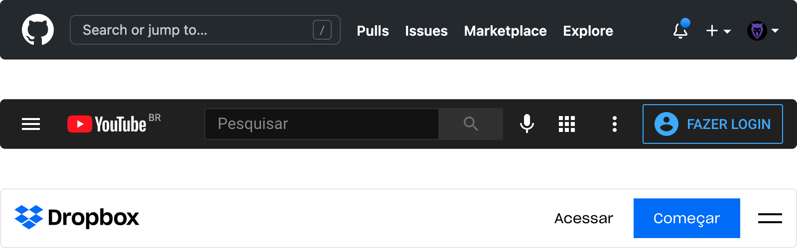
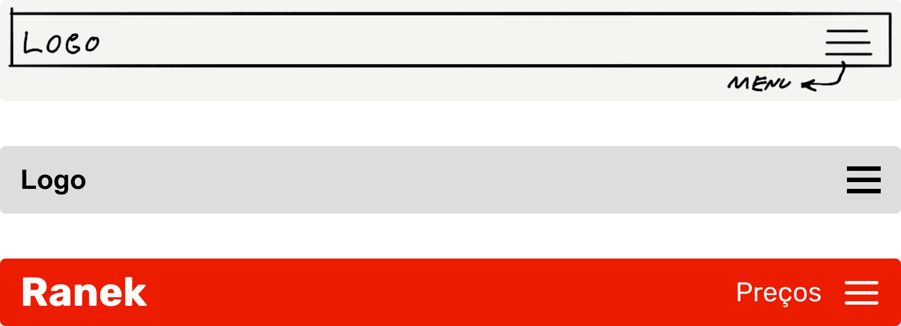
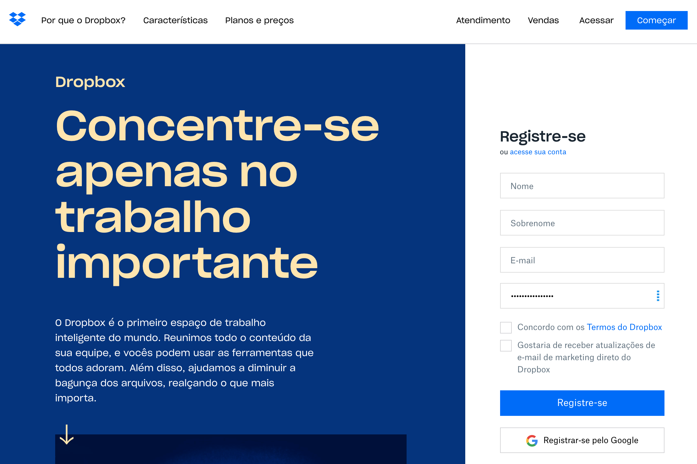
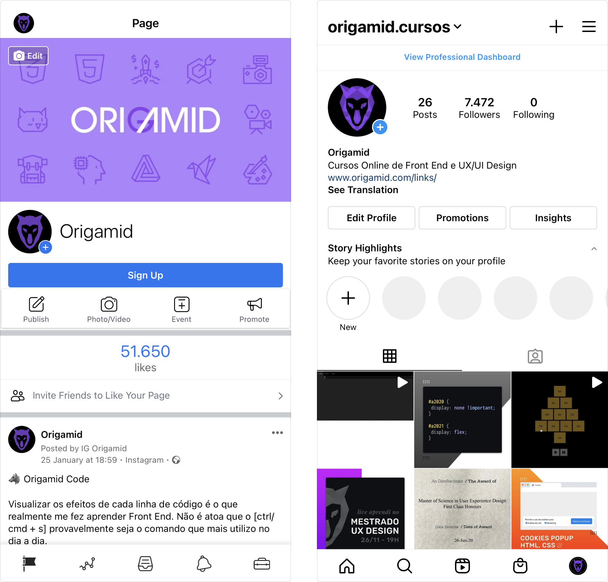

# Design

## Design é Projeto

### Plano
* Limites (sim/não = objetivos) e Pesquisa (contexto)

### Execução
* Desenho (protótipo/entrega) e Testes (iteração/melhorias)

- Alexandre Wollner: https://vimeo.com/13192992

## Plano
* Por mais simples que um menu se pareça, existe muita pesquisa e planejamento por trás da criação do mesmo.

- Menus do Github, YouTube e Dropbox

## Execução
* A execução do projeto é feita em etapas, cada etapa prioriza uma parte do projeto. Testar o artefato final é essencial para garantirmos uma boa experiência (ux).

- Etapas: Rascunho, Wireframe e Final

## Design é Intenção
* Escolhas são feitas para alcançamos os objetivos de maneira eficiente.

## Análise
* Podemos analisar/especular os motivos por trás de cada escolha.

- Página de registro do Dropbox

## Exercício
* Selecione 3 sites/apps que você utilize e compare as suas semelhanças e diferenças. Não se preocupe com termos técnicos.

* Ex: todos os sites possuem busca no menu, a página de cadastro pede X dados, é possível navegar pelo site através do rodapé e outras características.

## Exemplo

• O menu é localizado na parte inferior, possui 5 itens e utiliza ícones em linhas.

• Não são utilizadas etiquetas (label) próximo aos ícones.

• Os botões são retangulares e arredondados nas pontas.

• A foto de perfil é localizada dentro de um círculo.

• O texto utiliza preto e tons de cinza em um fundo branco.

• O azul é utilizado para chamar atenção (contraste).

- Comparação entre o Facebook e o Instagram