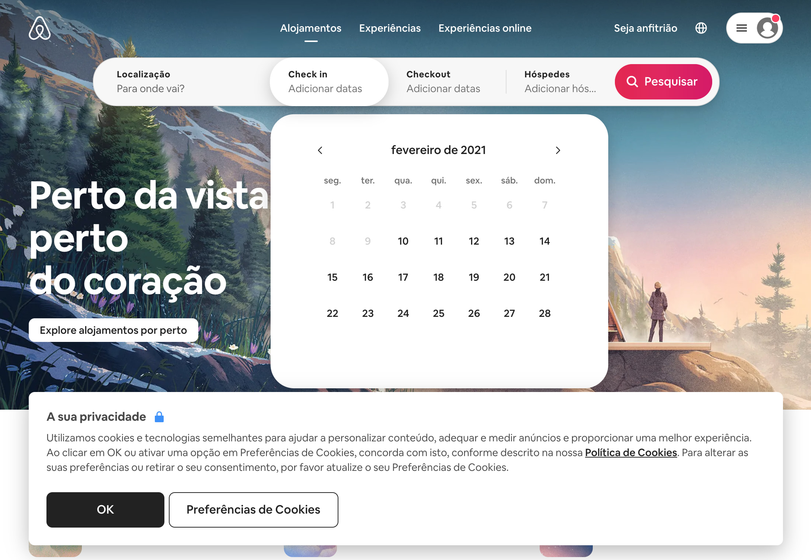
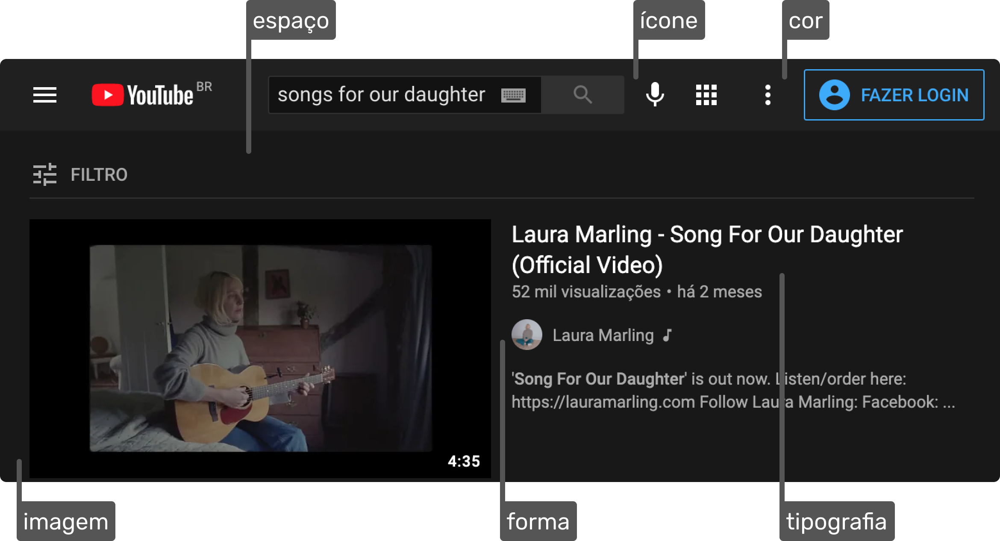
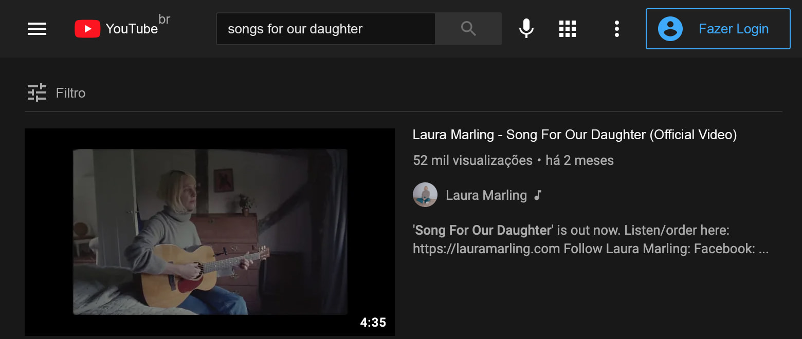
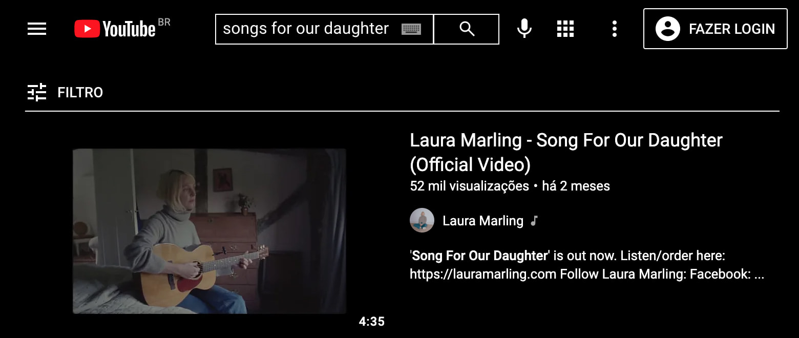
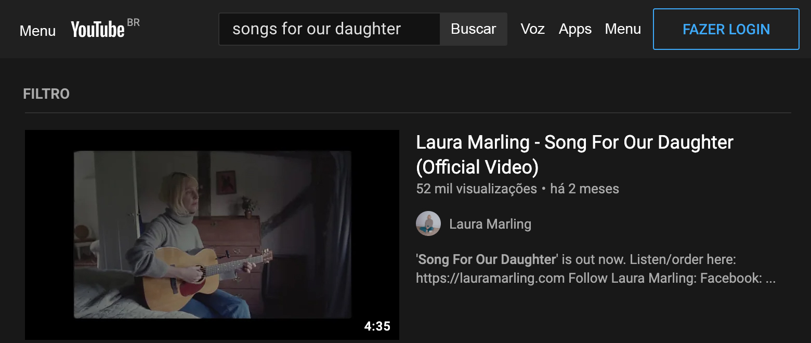
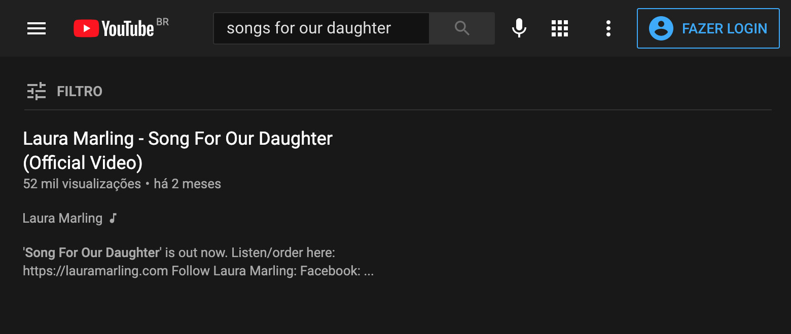
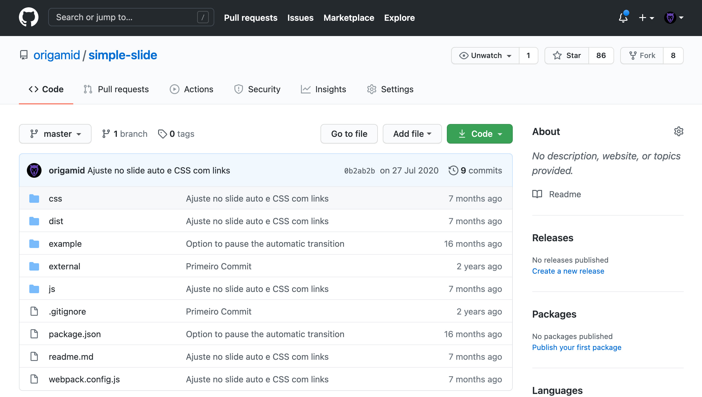

# UI Design

## UI Design
### UI = User Interface = Interface de Usuário
* Foco no aprendizado de interfaces digitais.

### Elementos da Interface
* Formas, espaço, cores, tipografia, imagens e ícones.

## Interface de Usuário
* Interfaces digitais são compostas por textos, textos funcionais, botões, imagens, ícones, vídeos e outros elementos.

## Elementos da Interface
* As escolhas devem ser consistentes com o projeto. É na consistência que criamos uma unidade, e fazemos com que todos os elementos da interface pareçam pertencer a mesma.

## Importância dos Elementos
* A ausência de um elemento apenas, pode arruinar o seu projeto.

### Original

### Sem Tipografia

### Sem Cores

### Sem Ícones

### Sem Imagens

### Sem espaço

## Boa Interface

### Propósito
* Existe um motivo claro para a existência do elemento.

### Consistência
* Os elementos se comunicam visualmente. Cores em harmonia, espaçamentos equivalentes, ícones de uma mesma família e mais.

### Necessários
* A remoção do mesmo tornaria a experiência pior.

## Exemplo de Interface

• Os ícones são consistentes

• O botão mais importante possui o maior contraste

• As informações disponíveis possuem propósito

## Exercício
* Selecione 2 sites e identifique todos os elementos da interface.