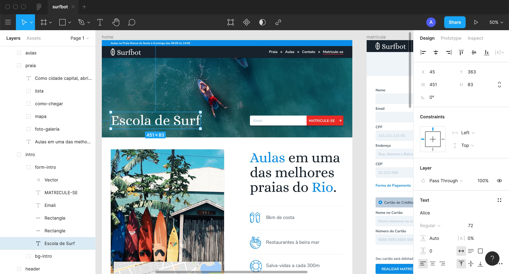

# Protótipo

## Protótipo

### Protótipo
* Explorarmos soluções/estilos e testes iniciais.

### Código
* O código deve ser criado com base no protótipo.

## Protótipo Exemplo

- Protótipo do curso de UI Design Avançado, feito no Figma.

## Você Escolhe
* Existem diversas ferramentas no mercado, todas possuem cerca de 95% das capacidades mais importantes, como a criação de formas, manipulações de vetores, alinhamento de elementos, seleção de tipografia e mais.

### Figma (web)
https://www.figma.com/

### Adobe XD (win/mac)
https://www.adobe.com/br/products/xd.html

### Sketch (mac)
https://www.sketch.com/