# Tipografia

## Tipografia

### "Web Design é 95% tipografia"
* iA - 2006

## Classificações

### Classificações
* Serifadas, sem serifas, monoespaçadas, cursivas e decorativas.

### Famílias
* Arial, Helvetica, Georgia, Futura, Roboto e outras.

### Fontes
Georgia Regular, Georgia Bold, Georgia Italic e outras.

## Serifadas
* As serifadas (serif) são caracterizadas pelos pequenos detalhes nas extremidades dos caracteres.

### Estilo
* Formal, clássico, luxo, literário e manual.

### Uso
* Corpo de texto e títulos.

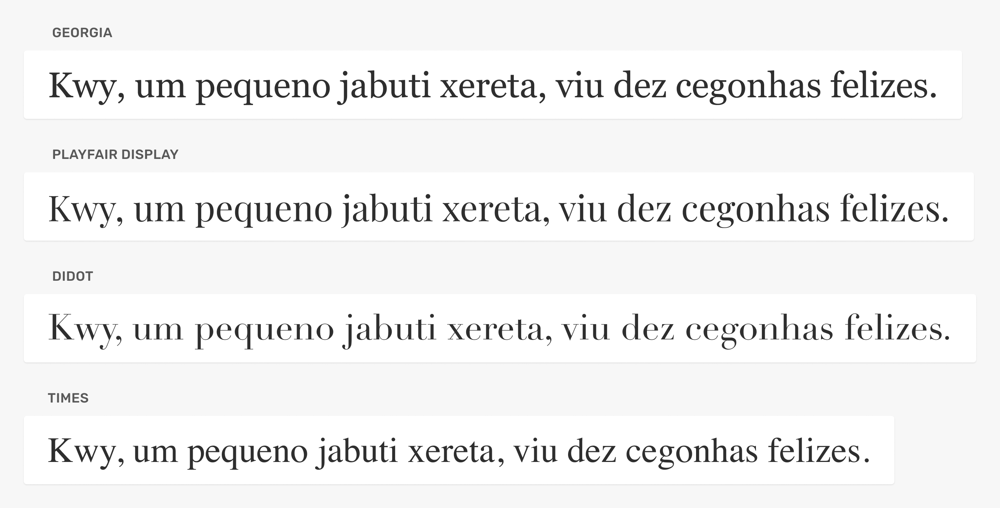

* Every utiliza serifadas nos títulos e corpo de texto, uma boa escolha para um site focado em escritores/leitores.

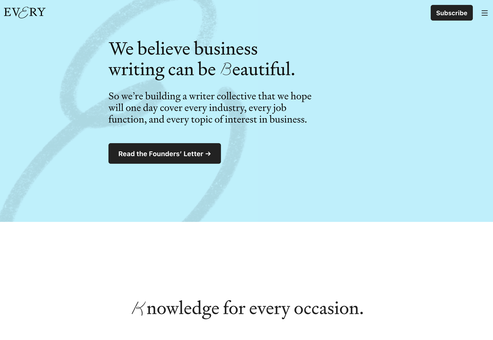

https://every.to/

## Sem Serifas
* As sem serifas (sans serif) são caracterizadas pelas suas formas neutras e pela ausência das serifas.

### Estilo
* Neutro, digital, objetivo e informal.

### Uso
* Corpo de texto, títulos e texto funcional (botões, links, abas).

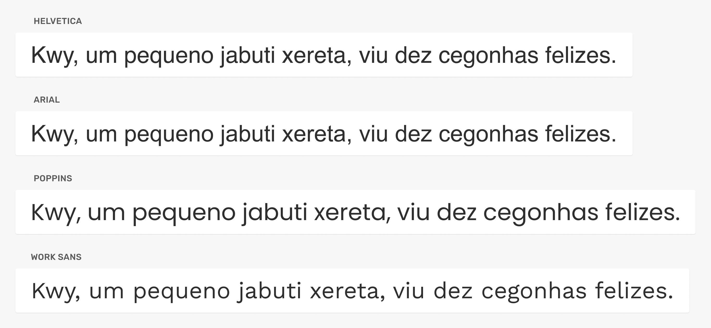

* A marca Moy comunica objetividade através do uso de tipografias neutras e sem serifas em toda a interface.

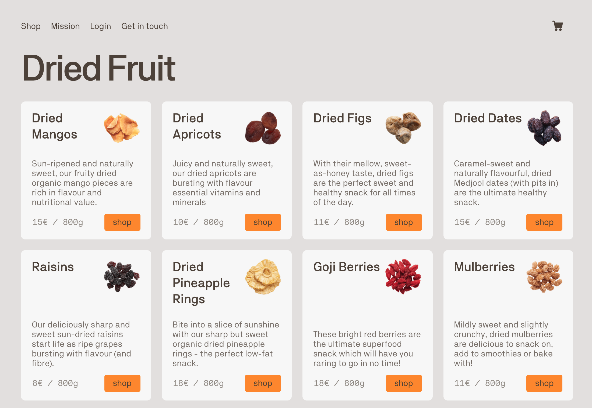

https://www.moy.is/

## Monoespaçadas
* As monoespaçadas (monospace) possuem todos os seus caracteres com a mesma largura, permitindo que linhas de texto se alinhem perfeitamente uma abaixo da outra.

### Estilo
* Digital, objetivo e técnico.

### Uso
* Dados, tabelas e código.

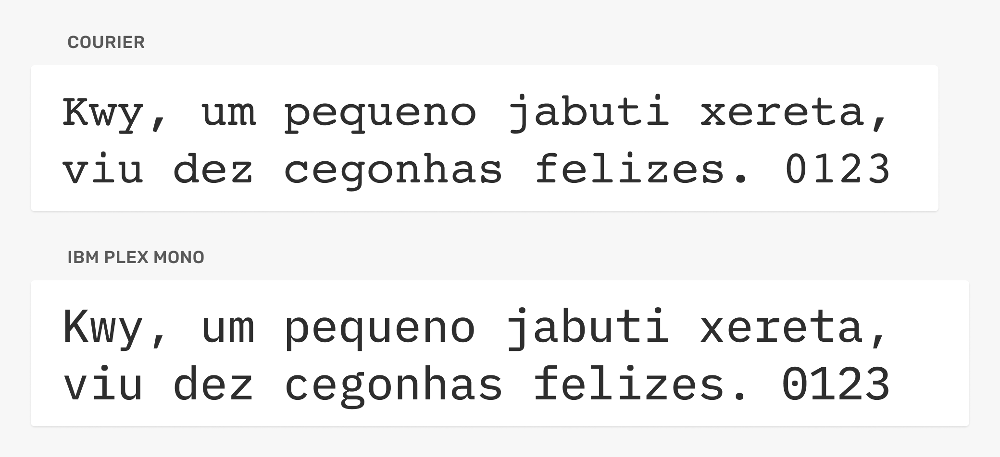

* Tipografia monoespaçada é utilizada na interface do Github para mostrar o código dos arquivos. Os outros elementos da interface utilizam uma tipografia sem serifa.

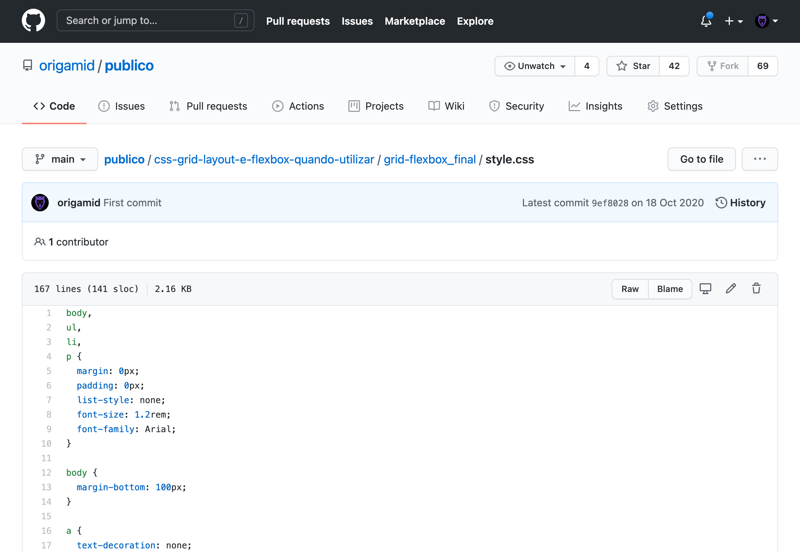

https://github.com/

## Cursiva
* As tipografias cursivas (script/handwriting) tentam imitar a escrita ocidental com formas orgânicas e geralmente ligadas entre si.

### Estilo
* Manual e celebrações.

### Uso
* Títulos e pequenos textos.

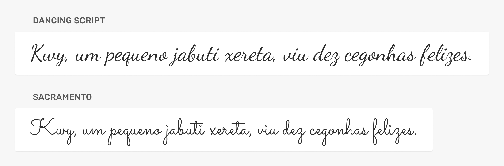

* O site Bide utiliza tipografia cursiva para nomes no texto principal.

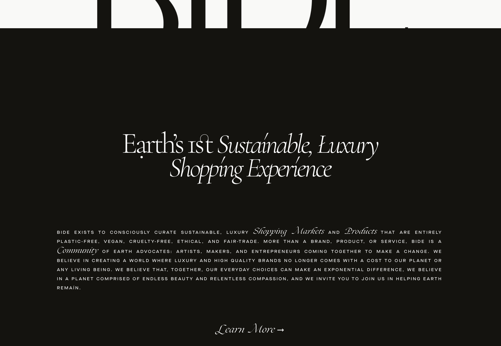

https://www.bidemarket.com/

## Decorativas
* Tipografias decorativas (display) são todas aquelas que possuem características fortes que as tornam distintas de qualquer outra tipografia. Elas podem dar vida ou arruinar um projeto.

### Estilo
* Site temático.

### Uso
* Títulos e pequenos textos.

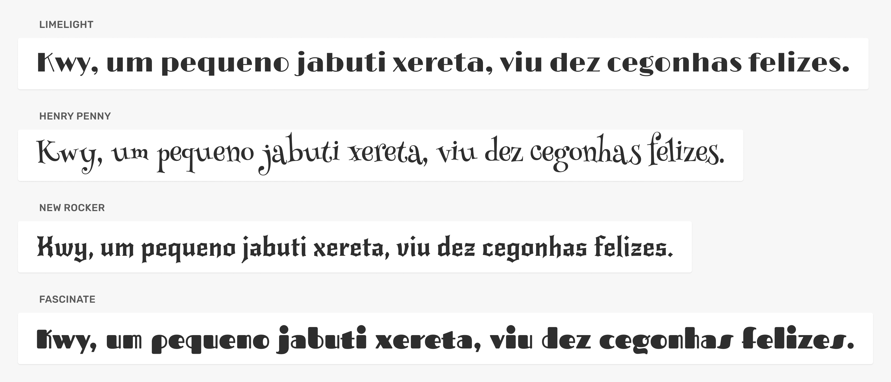

* O site Drink Monday utiliza uma tipografia que lembra o estilo art nouveau em contraste com o estilo art déco da marca Monday.

https://drinkmonday.co/

## Famílias
* O desenho de uma tipografia feito por um designer de tipos define uma família tipográfica. As famílias tipográficas são as mais variadas possíveis e geralmente possuem influências históricas.

Quando um designer cria uma família tipográfica que possui diferentes classificações, temos uma super família.

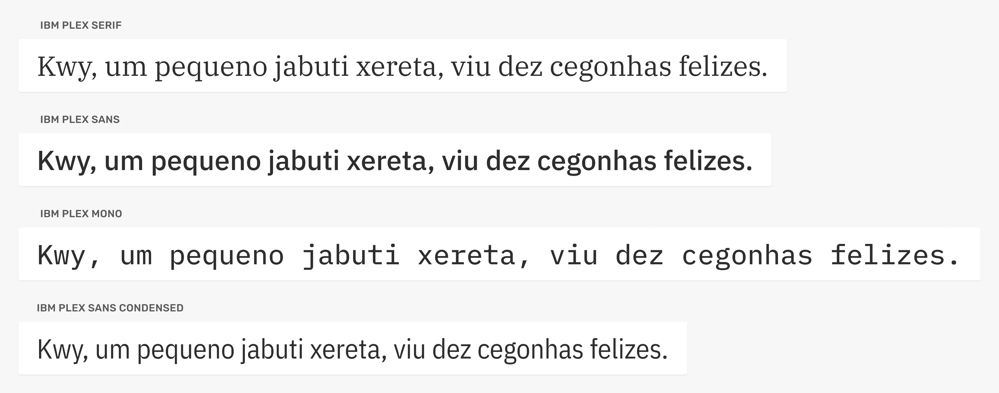

## Fontes
* A família tipográfica é composta por diferentes fontes que podem variar desde o peso (regular/bold) ao estilo (oblique/italic). A fonte é o arquivo final.

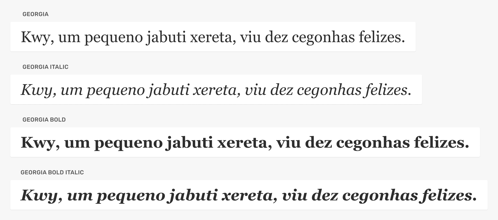

* Além de estilos pré-definidos pelo designer de tipos, hoje em dia existem também fontes variáveis que te permitem criar fontes com um ajuste mais fino: 
https://web.dev/variable-fonts/

Toda fonte possui a sua classificação, família e peso.

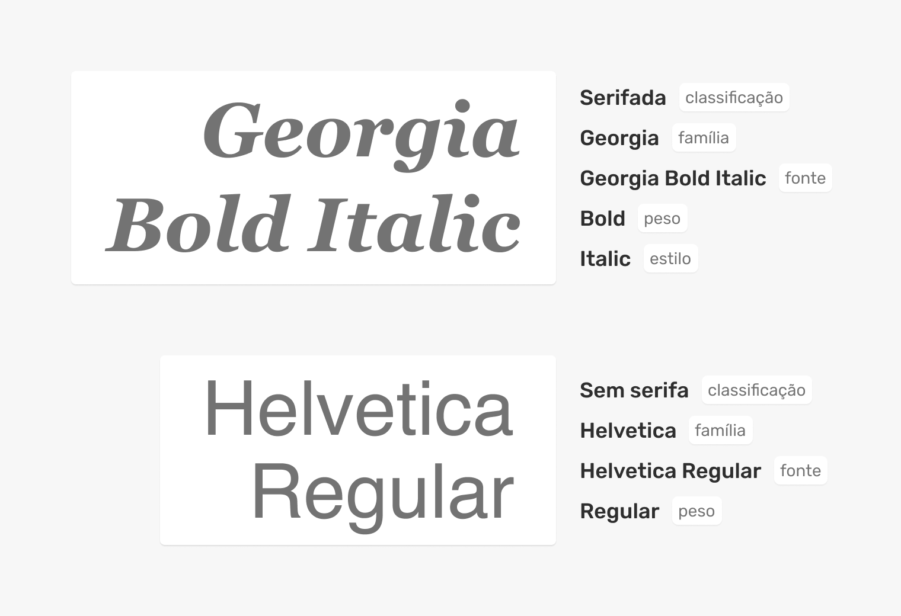

## Contraste

### Fontes
* O uso de diferentes fontes facilita a criação de contraste entre os elementos.

### Famílias
* Evite utilizar famílias parecidas e se limite ao uso de duas diferentes (iniciantes).

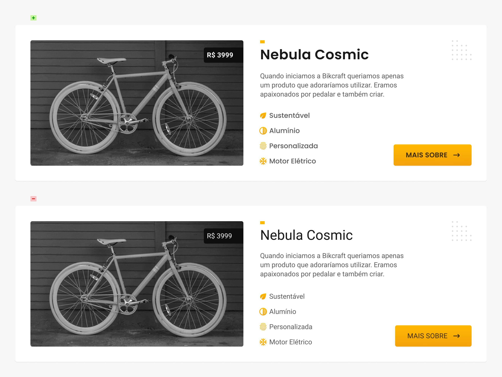

* Apesar da Roboto (corpo de texto) e Poppins (título, lista e botão) serem ambas sem serifas, a Poppins é uma geométrica e possui características diferentes o suficientes para criar contraste entre as mesmas.