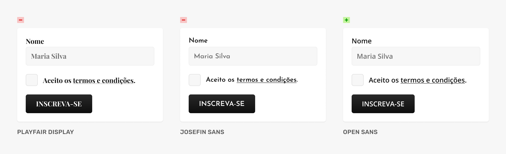
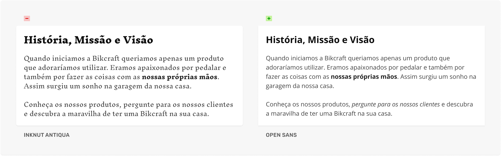
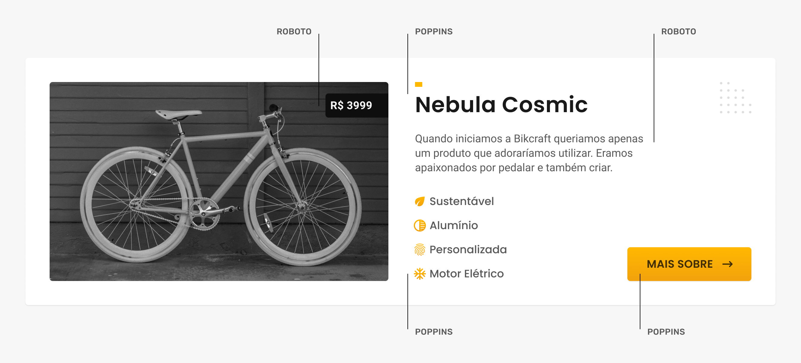

# Escolha Tipográfica

## Usos

### Título
* Títulos de páginas, seções, nomes de produtos, listas (pequenas)

### Corpo
* Artigos, descrições de produtos, perguntas e respostas

### Funcional
* Botões, links, formulários, notificações, etiquetas

## Funcional

### Neutra
* Geralmente são usadas sem serifas com foco na legibilidade.

### Evite
* Fontes com caracteres fortes ou pouco contraste entre os mesmos.

### Variações
* Opte por fontes com variações de pesos e estilos.

### Sugestões
* Arial, Open Sans, Roboto, Source Sans, IBM Plex Sans, Lato

* Não teste a fonte em um contexto isolado. Crie diversos componentes e troque todas as fontes de uma vez para verificar como a mesma impacta no todo.

## Corpo

### Leiturabilidade
* Serifadas e sem serifas funcionam para o corpo de texto. A escolha depende do estilo do site.

### Familiar
* Quanto mais familiar a tipografia for, maior facilidade o usuário terá para ler.

### Variações
* Opte por famílias com variações de pesos e estilos.

### Sugestões
* Arial, Roboto Slab, Open Sans, Alegreya

* As variações de peso e estilo de uma família permitem criarmos contraste no corpo de texto. O contraste serve para destacarmos palavras ou frases.

## Título

### Estilo
* A escolha pode ajudar a definir o estilo gráfico do site.

### Consistência
* As características devem se comunicar com as dos demais elementos.

### Diferente?
* Não existe necessidade de ser diferente, ela pode ser a mesma utilizada no corpo/funcional.

## Fontes

### Google Fonts
* https://fonts.google.com/

### Adobe Fonts
* https://fonts.adobe.com/

### Typewolf (inspiração)
* https://www.typewolf.com/