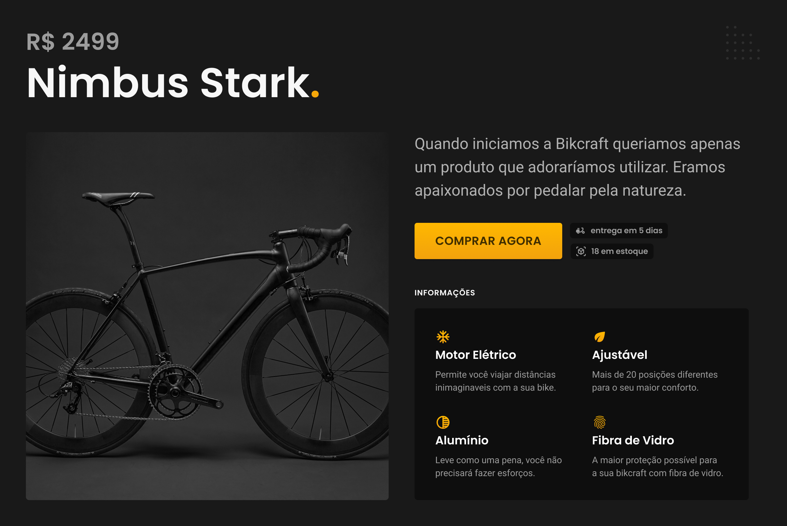
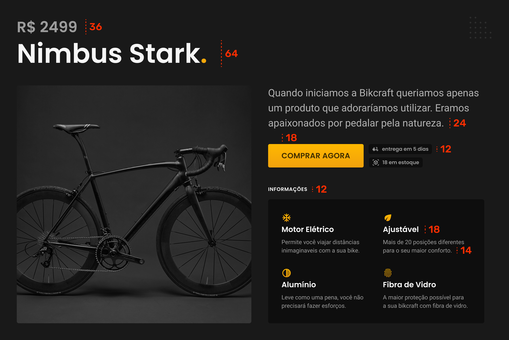
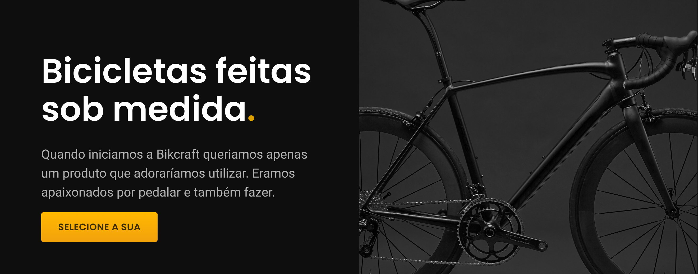
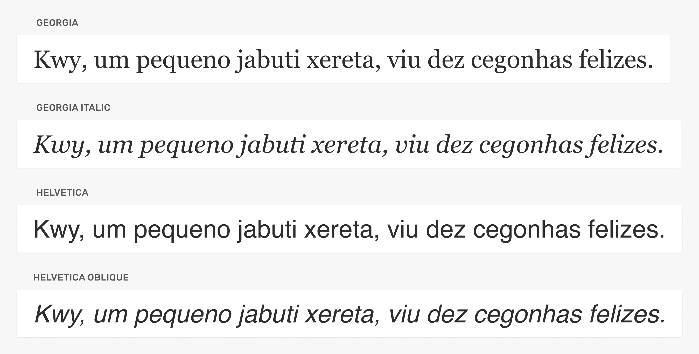
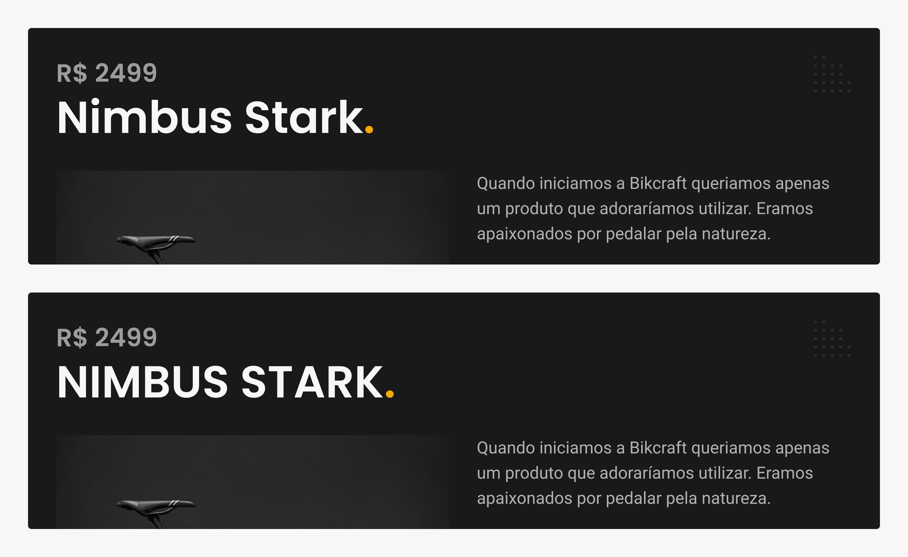
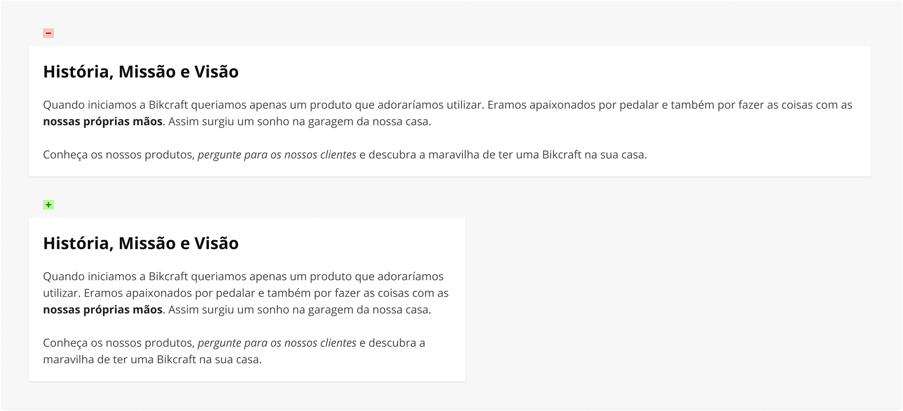
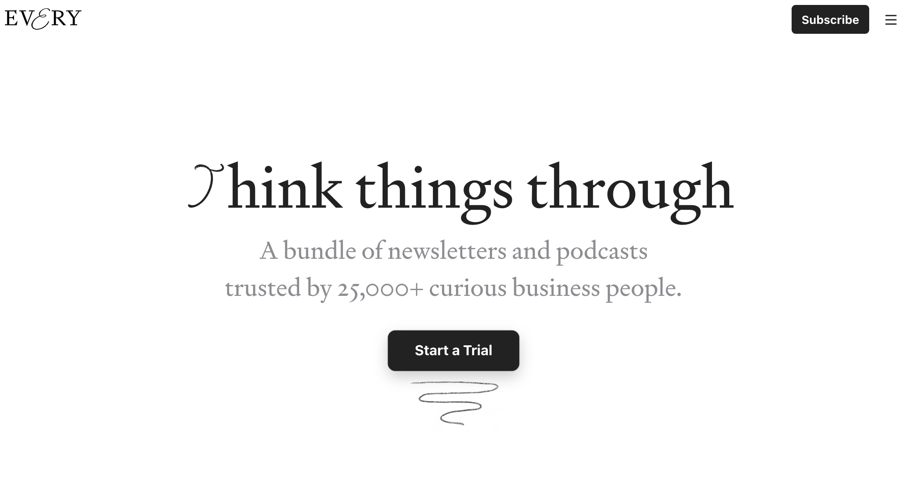

# Variáveis Tipográficas

## Variáveis Tipográficas

### Escala

### Altura de Linha

### Peso e Estilo

### Maiúsculas

### Largura de Linha

### Espaçamento

### Alinhamento

## Escala

### Definir uma escala
* Entre 6 e 12 variações são suficientes para definir a hierarquia.

### Contraste
* Opte por valores que possuam diferenças significativas.
* Use: 14 e 18 (28%). Não use: 44 e 48 (9%).

### Legibilidade / Leiturabilidade
* Entre 14 - 24 para corpo de texto.

### Google Material (boa escala)
* https://material.io/design/typography/the-type-system.html#type-scale

* Sem uma diferença de tamanho entre os textos, a hierarquia não fica bem definida.

## Altura de Linha
* A altura de linha possui dependência direta com a escala e tipografia.

### Corpo
* Entre 14 e 24 - use entre 1.3x à 1.5x. Ex: 16/24 ou 24/36.

### Corpo Exemplos:
* Medium: 21/32 (1.52), Google: 14/22 (1.57), Airbnb: 16/24 (1.5)

### Título
* Acima de 30 - use entre 1x e 1.25x. Ex: 32/40 ou 64/72.

### Título Exemplos:

* Airbnb: 30/36 (1.2), Stripe: 94/98 (1.04), Medium: 46/56 (1.22)

#### Título: 64/72 (1.1), Corpo: 24/36 (1.5)

#### Título: 64/96 (1.5), Corpo: 24/26 (1.1)

## Peso e Estilo
* O peso e o estilo são utilizados para criar contraste entre uma mesma família.

### Corpo
* Dentro de um corpo de texto o peso serve para ênfase, enquanto o estilo itálico/oblíquo serve para destacarmos nomes, palavras estrangeiras e frases.

### Peso
* Geralmente vão de 100 a 900 e podem também ser representados com nomes: Light, Regular, Normal, Semibold, Bold e Black.

### Estilo
* Pode ser normal/regular, itálico ou oblíquo. O itálico além de inclinar a tipografia, também modifica alguns caracteres para melhor representar o estilo. Cuidado com itálicos falsos, forçados pelo software.

## Maiúsculas

### Título
* Em títulos a escolha entre maiúsculas e minúsculas está relacionada ao desenho dos caracteres.

### Funcional
* O uso de maiúsculas é comum em textos funcionais (botões), por criarem um bloco com a tipografia, devido à ausência de ascendentes e descendentes. Esse bloco torna o alinhamento mais consistente.

## Largura de Linha
* Controlar a largura de linha é essencial para o corpo de texto. Uma largura muito grande dificulta a leitura.

### Dica
* Entre 45 e 75 caracteres (13 palavras). Sempre controle a largura, mesmo que o seu site tenha um layout fluído, defina o max-width do conteúdo.

### Exemplos
* Google: 85, Medium: 80, New York Times: 65.

## Espaçamento
* O espaçamento entre os caracteres (tracking/letter-spacing) pode ser modificado, mas cuidado com exageros. Geralmente o definido pelo criador é o ideal.
* Maiúsculas podem se beneficiar com o aumento do letter-spacing.

## Alinhamento

### Esquerda
* O mais comum e recomendado para a web.

### Direita
* Depende do layout, pode funcionar em casos que você possui uma foto à direita e o texto à esquerda.

### Centralizado
* Funciona para títulos e pequenos textos. Mas deve respeitar o layout do site.

* Every faz um bom uso do alinhamento centralizado para criar foco no conteúdo.

https://every.to/