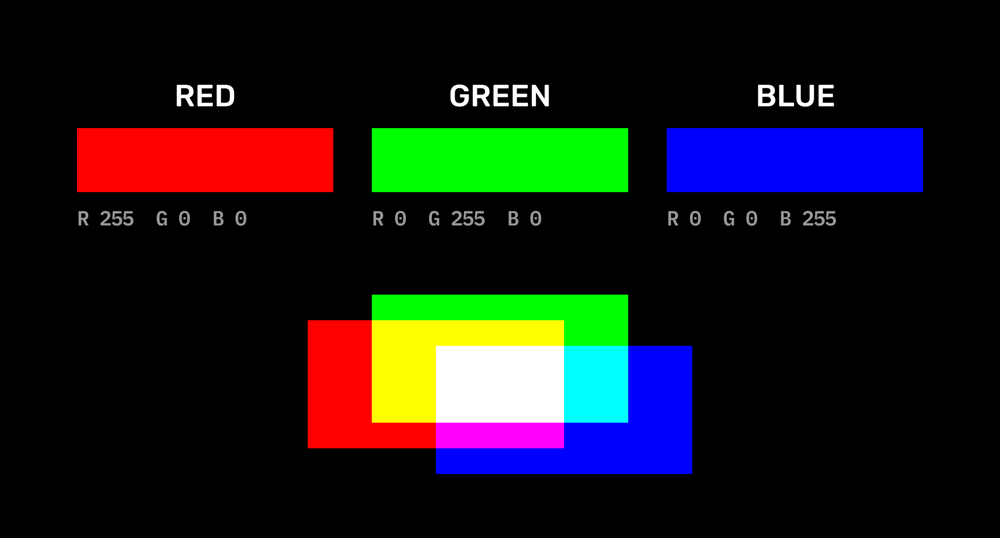
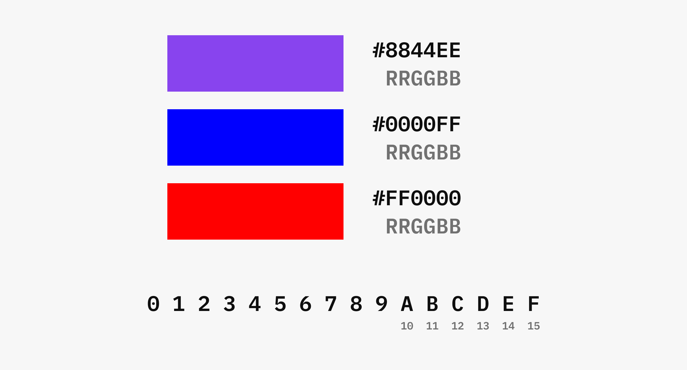
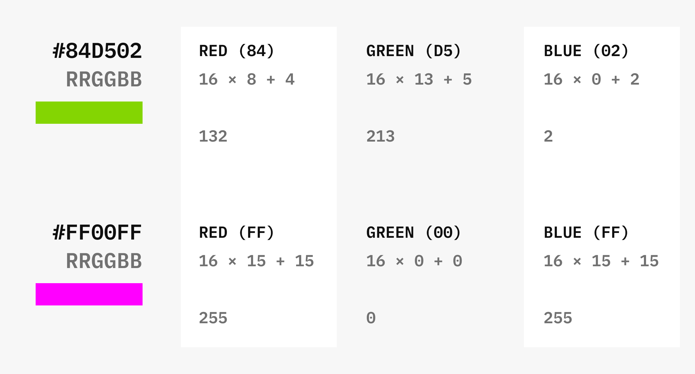
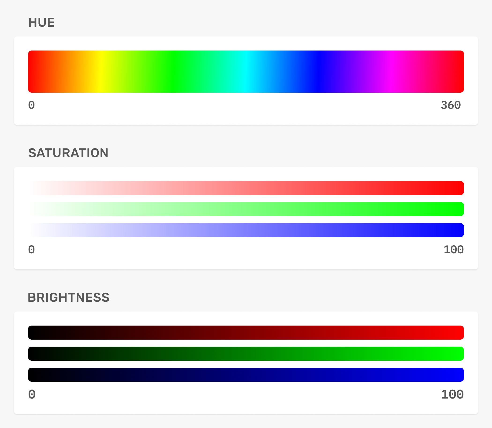

# Cores

## RGB
* As telas são compostas por minúsculas "lâmpadas" que emitem as cores vermelha (red), verde (green) e azul (blue). As 3 cores combinadas (aditivas) formam todas as outras possíveis de se ver em uma tela.
* Podemos controlar essas cores com valores de 0 a 255, sendo 0 totalmente apagada e 255 totalmente acesa.

## Hexadecimal
* Formato em código com 16 possíveis valores (hexa) que define o RGB da cor.

* Cálculo: multiplicar o primeiro valor por 16 e somar ao segundo.

## HSB

### Hue (matiz)
* A cor, de 0 a 360.

### Saturation (saturação)
* A intensidade da cor, de 0 a 100

### Brightness (brilho)
* Preto/branco na cor, de 0 a 100.

