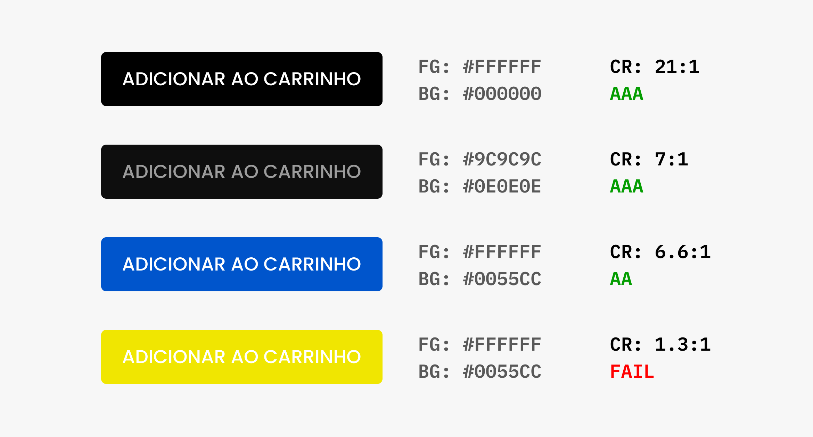

# Cores em Interfaces

## Funções

### Contraste
### Hierarquia
### Informação
### Identidade

## Contraste
* A função mais importante da cor é criar contraste entre os elementos e permitir diferenciarmos os mesmos. Acertar o contraste no texto é essencial para criarmos um site acessível.

* Plum Guide possui contraste suficiente nos textos para garantir uma boa leitura.

https://www.plumguide.com/

## Acessibilidade
* As diretrizes WCAG (Web Content Accessibility Guidelines) definem um cálculo específico que indica se o contraste entre o fundo e a tipografia é acessível ou não.

* https://www.w3.org/Translations/WCAG20-pt-br/

### Contraste
* https://contrast-ratio.com/

### Daltonismo
* Você também pode verificar se as suas cores funcionam para pessoas daltônicas: https://www.color-blindness.com/coblis-color-blindness-simulator/

* Nem sempre o cálculo WCAG é otimizado, um mini estudo encontrou diferenças em fundos coloridos: https://www.bounteous.com/insights/2019/03/22/orange-you-accessible-mini-case-study-color-ratio/

## Hierarquia
* O uso de diferentes cores e contraste definem a hierarquia da informação na tela. Sem diferenciação todos os elementos passam a ter o mesmo peso.

* O Github utiliza o verde para definir a hierarquia do principal botão da página.

https://github.com/origamid/simple-slide

## Informação
* A cor também serve como informação. Essa informação depende da cultura e de experiências anteriores do usuário.

* Um site pode definir o seu próprio sistema de informação, como o globo.com, que utiliza vermelho para notícias, laranja para entretenimento e verde para esporte.

* O Gmail utiliza o vermelho para indicar que existe um erro no formulário.

## Identidade
* A cor também serve para definir a identidade da interface e da marca. No site do projeto Bikcraft o amarelo é utilizado para reforçar a identidade da marca.

