# Paleta de Cores

## Interface

### Base
* Textos, formulários, links secundários, fundos: tons de cinza

### Ênfase
* Título, botões, ícones, fundos, links: cor da identidade

### Funcionais
* Alerta, erros, notificações, links: verde, vermelho e amarelo

* O Github utiliza tons de cinza como base e o azul/verde para cores de ênfase.
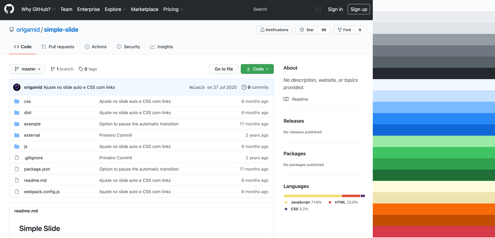

## Variações da Cor
* Na natureza dificilmente encontramos uma cor pura, geralmente a cor é seguida por diversas variações da mesma. Para toda cor que decidirmos utilizar no projeto, ter variações será essencial para compormos a interface.

* Em uma variação natural, geralmente a saturação aumenta, enquanto o brilho diminui e mudanças são feitas na matiz para ajustar a luminosidade.
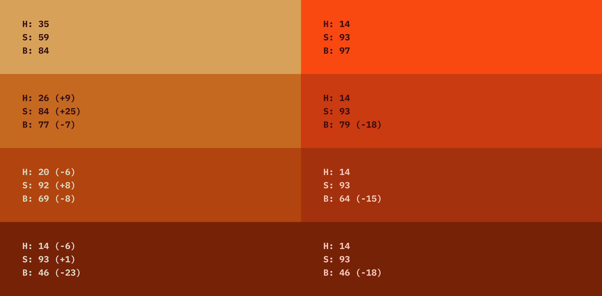

* As cores possuem luminosidades diferentes, por isso o amarelo é percebido mais claro, independente dos seus valores de saturação e brilho.
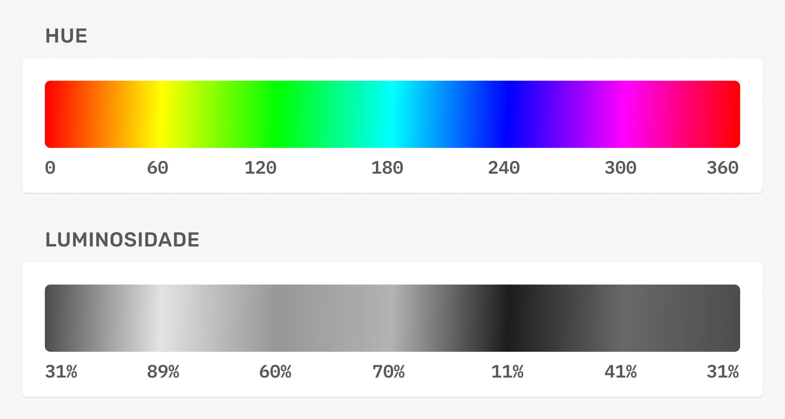

A variação da cor geralmente ocorre na diagonal da matriz HSB.
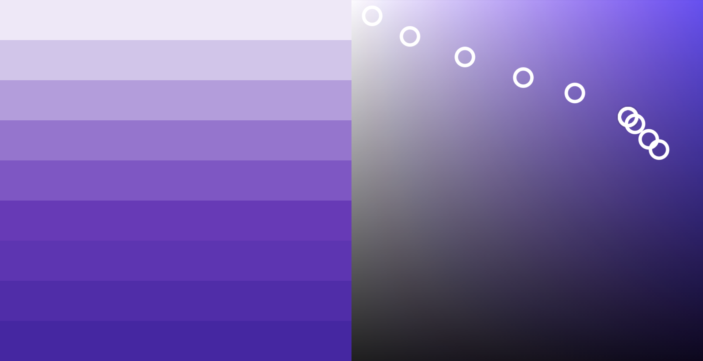

## Base

### Saturação Baixa
* Cores com saturação baixa (tons de cinza) são as cores mais utilizadas nas interfaces. Elas irão compor a base de fundos, títulos, corpo de texto e mais. A saturação apenas aumenta quando diminuímos o brilho.

### Tons de Cinza
* Interfaces de aplicativos como Facebook, YouTube, Instagram, Nubank, Tinder, Netflix e outros geralmente utilizam tons de cinza (neutro ou frio) como a cor de base.

### Qual utilizar?
* Aplicativos para uso diário use tons de cinza. Explore outros tons em site promocional/institucional, mas pode usar tons de cinza sem problemas.

* Verdes dessaturados são utilizados em textos, sombras e fundos do site The Loft.
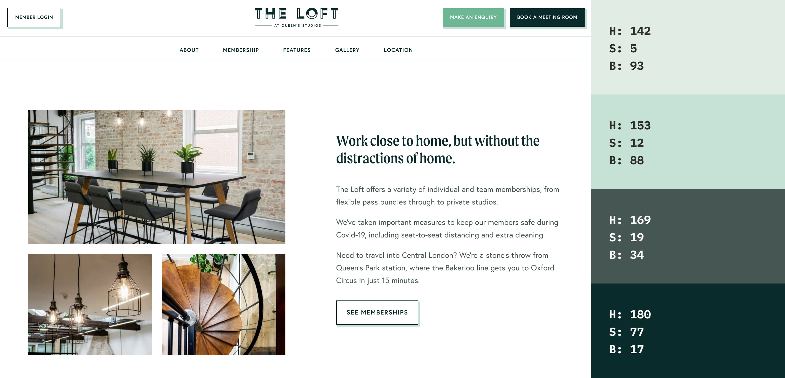
https://theloftnw6.com/

* Marrons dessaturados são utilizados em textos, títulos e fundos do site Ramp.
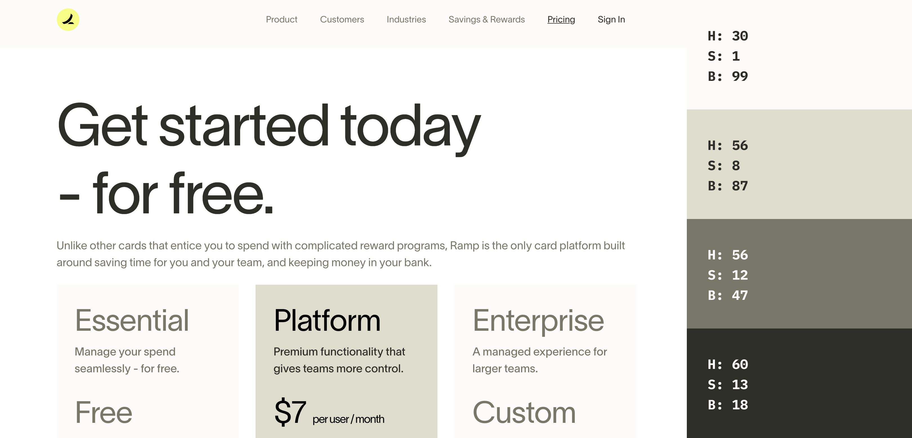
https://ramp.com/

* O Youtube utiliza tons de cinza (neutro) para a base.
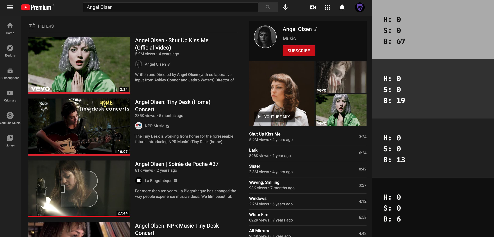
https://www.youtube.com/

* O Github utiliza tons de cinza (frio) para a base.
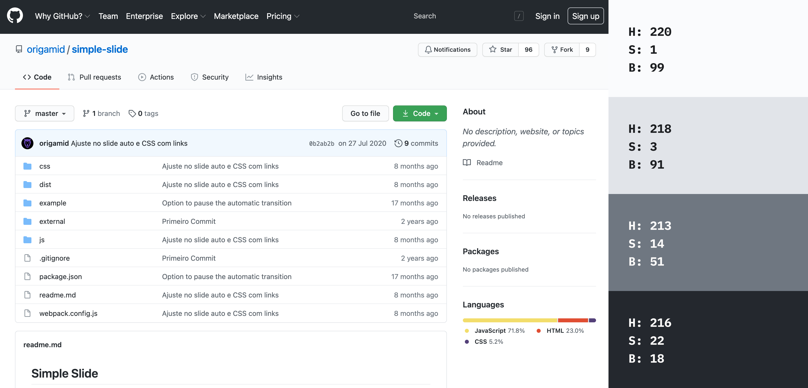
https://github.com/

## Tons de Cinza
Cerca de 12 variações são suficientes para te dar bastante flexibilidade na criação de interfaces. Garanta que os valores selecionados funcionem em conjunto (contraste seguindo as diretrizes WCAG).
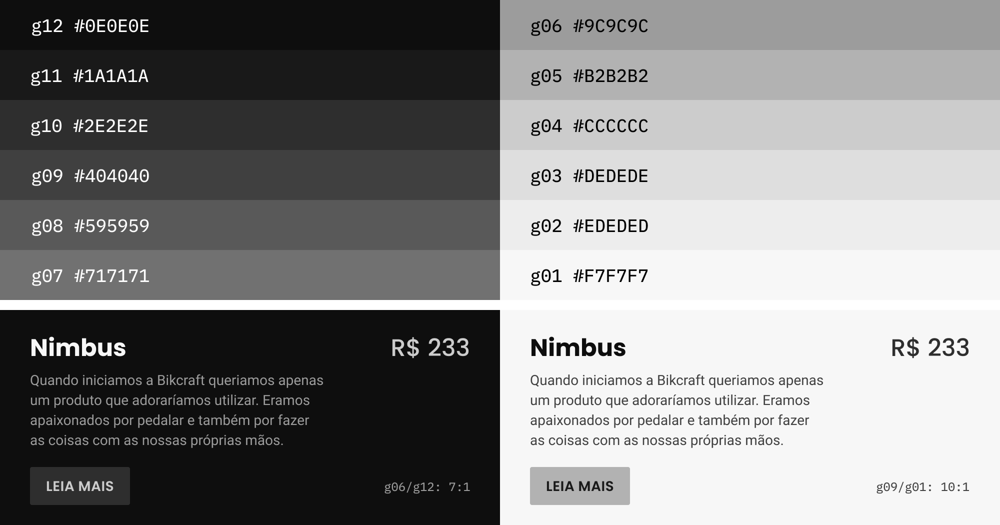

* Fora das telas dificilmente encontramos o cinza puro, pois a cor é influenciada pela luz que a ilumina.

* Em ambientes de luz fria o cinza está sempre mais azulado, enquanto em ambientes de luz quente o cinza possui um pouco mais de amarelo/vermelho.
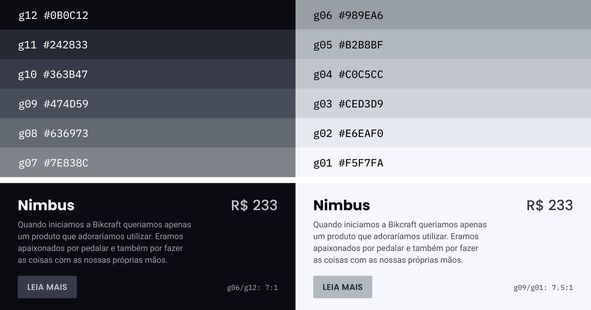

* Por mais que a máquina de escrever pareça ser totalmente preta, o azul está presente em todos os tons de cinza da mesma.
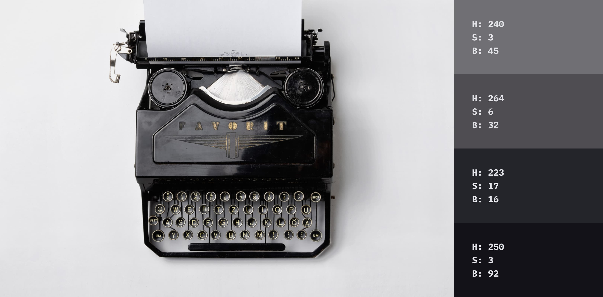

## Ênfase

### Identidade
* Geralmente é baseada na identidade da marca. Ex: A Amazon utiliza o laranja como cor de ênfase e já as Americanas utiliza o vermelho.

### Contraste
* Serve para destacarmos títulos, botões e outros elementos importantes.

### Influência na cor de base
* Dependendo do projeto a cor de ênfase pode influenciar diretamente a cor de base, mudando de um tom de cinza neutro para um tom de cinza esverdeado.

* O The Loft utiliza o verde como cor de ênfase. Note que diversos tons de verde são utilizados em elementos como sombras e backgrounds. A cor de base do site é "contaminada" pela de ênfase, e os tons de cinza são esverdeados.
https://theloftnw6.com/

## Tom sobre Tom
* Quando não criamos variações da cor de enfase, tendemos a utilizar um dos tons de cinza acima da mesma. E geralmente o efeito não é o melhor possível, já que o tom de cinza não possui as características da cor de fundo.
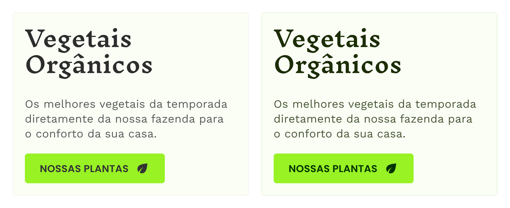

## Funcionais
Essas são cores extras que servirão principalmente para informar o usuário sobre o status do sistema. Elas podem ser influenciadas pelas demais cores do site.
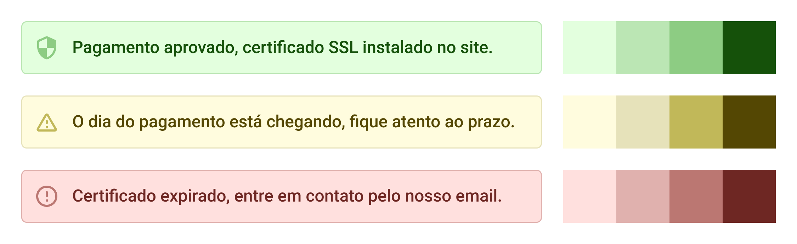
