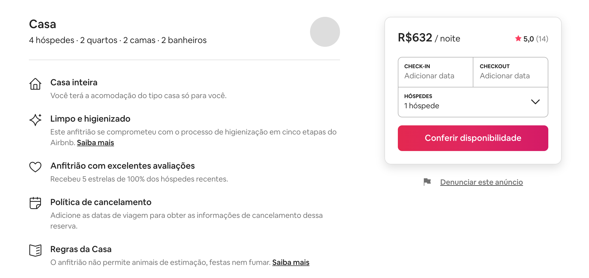
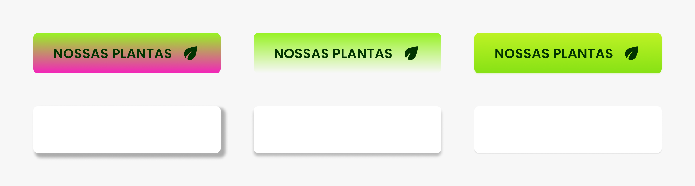

# Luz e Sombra

## Luz e Sombra

### Profundidade
* Luz e sombra servem para recriarmos a percepção de profundidade que enxergamos no mundo.

### Contraste
* A profundidade é mais uma técnica para criação de contraste entre os elementos.

* No Airbnb a sombra é utilizada para destacar a principal parte do site.

https://www.airbnb.com.br/

* No Instagram a sombra é utilizada para separar o conteúdo do seu contexto.

* O Tailwind utilizada o gradiente para elevar ícones e caixas do site.

https://tailwindcss.com/

## Sombra
* A sombra depende da direção da luz e do objeto.

## Elevação
* Diferentes configurações da sombra criam a ilusão de diferentes elevações na tela.

### Google Material
* O estilo visual definido pelo Google para o uso em seus sistemas de design, fez um estudo profundo sobre o uso de elevações em interfaces: https://material.io/design/environment/elevation.html

## Gradiente
* O gradiente deve ser sutil e seguir as mesmas regras das variações de cores. Geralmente a cor mais clara vem de cima para baixo, assim como a luz.

* O gradiente pode dar vida aos elementos da interface.

## Sutileza

### Sutil
* Seja sutil no uso de sombras e gradientes, não utilize sombras fortes ou gradientes que não seguem a regra de transição de cores. Siga a luz que geralmente vem de cima (claro para escuro).

### Evite
* Evite variar para cores não análogas (análogas são cores próximas no slide da matiz) ou para a mesma cor mudando apenas a sua opacidade.

