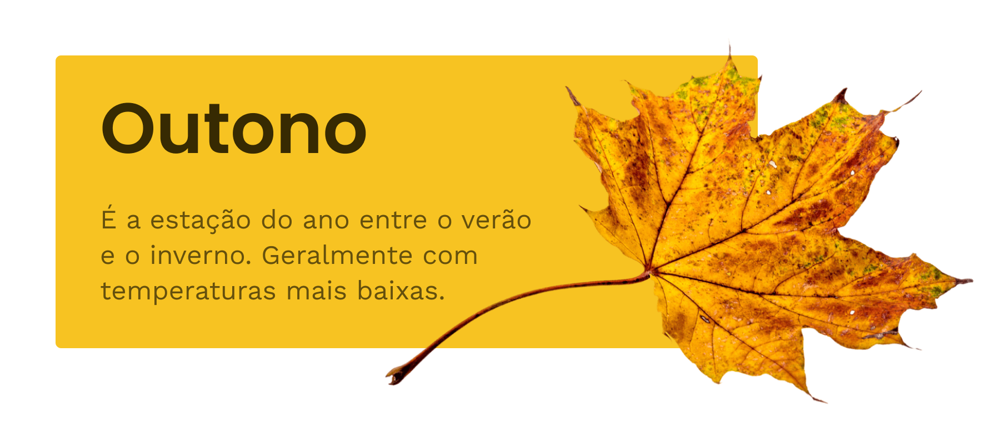

# Imagens Formatos

## Formatos

### JPG
* Fotos

### PNG
* Fotos com fundo transparente e imagens vetoriais.

### SVG
* Imagens vetoriais, ícones, marcas, ilustrações.

## JPG
* O formato jpg é o ideal para imagens com diversas cores, como fotografias.

## PNG
* O PNG é utilizado para imagens com fundo transparente e imagens vetoriais (marcas, ilustrações e outras).

* A remoção do fundo da folha, permite posicionarmos a mesma acima da interface.

* Ilustrações com poucas cores são geralmente utilizadas em formato png.

https://undraw.co/illustrations

## SVG
* O SVG (scalable vector graphics) é um formato onde as imagens são formadas a partir de uma linguagem de código (XML). Este permite criarmos imagens que pode ser escaladas infinitamente sem perdermos a qualidade da mesma.

* Por ser baseado em código, geralmente o tamanho em bytes é menor. Este formato é ideal para marcas, ícones, decorações e ilustrações vetoriais.

* PNG e SVG escalados de 220x180 para 600x490.

## Densidade
* Existem telas com diferentes densidades de pixels. Um monitor de 24" com resolução máxima de 1920x1080 (HD) possui metade dos pixels pixels de um monitor de 24" com resolução de 3840x2160 (4k).

* Isso significa que para uma imagem não parecer pixelada em um monitor 4k a mesma deve possuir o dobro do tamanho físico que ocupará na tela.

* Diferença entre as imagens nos seus tamanhos reais vs escaladas.

* Por este motivo (perceba a qualidade entre as imagens) o ideal é utilizarmos SVG's, pois independente da densidade ele sempre manterá a qualidade máxima.