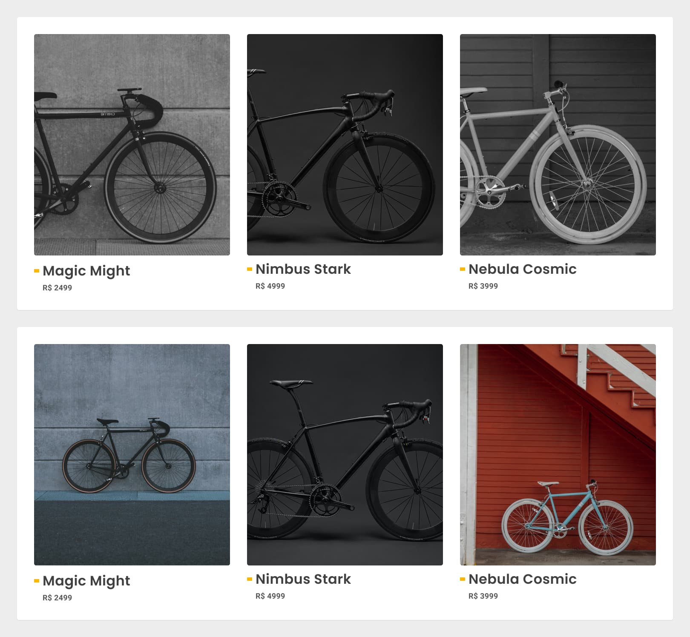
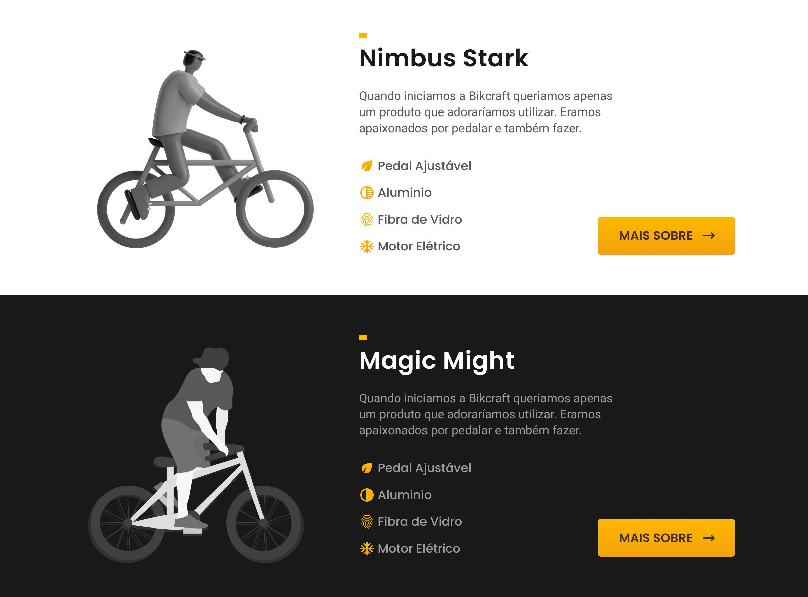

# Imagens em Interfaces

## Imagens em Interfaces

### Consistência

### Texto e Imagem

### Fontes

## Consistência
* As imagens devem possuir iluminação/cores e estilo/composições similares para serem utilizadas juntas.

* Evite utilizar ilustrações de artistas/projetos diferentes. No exemplo abaixo, dois estilos diferentes são utilizados, criando uma inconsistência na interface.

## Texto e Imagem
* O texto deve ser legível. Para isso geralmente utilizamos textos em branco em cima de imagens escuras ou textos pretos em cima de imagens claras.

## Fontes

### Profissional
* Contratar um ilustrador ou fotógrafo para criar as imagens do site.

### Gratuito

* https://unsplash.com/

* https://dribbble.com/search/free

### Pagos

* https://www.shutterstock.com/pt/