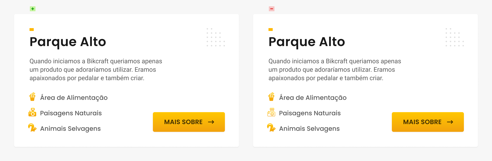

# Ícones

## Ícones

### Pista visual
* Ajuda a encontrar o que se procura.

### Comunicam
* Ex: Garfo e Faca significa restaurante.

### Aprendidos
* Três traços significa menu.

## Consistência
* Utilize ícones de um mesmo projeto/designer. A consistência dos ícones está em pequenos detalhes como a largura do traço, ou no uso de preenchimento.

### Traço

### Cores

### Estilo

## Fontes

### Material Icons

* https://fonts.google.com/icons

### Streamline

* https://streamlineicons.com/download/

### The Noun Project

* https://thenounproject.com/