# Navegação Componentes

## Componentes

### Menu

### Tabs

### Breadcrumb

### Footer

## Menu Principal (Header)

### Marca
* Na esquerda, clica volta para a home.

### Menu
* Na direita, o mais simples possível.

### Busca?
* Campo de busca em sites de conteúdo (YouTube, Github).

### Fixo?
* Depende do tamanho do conteúdo, se for fixo e grande diminuir o mesmo.

* Anatomia de um cabeçalho (header) simples em seu formato desktop e mobile.

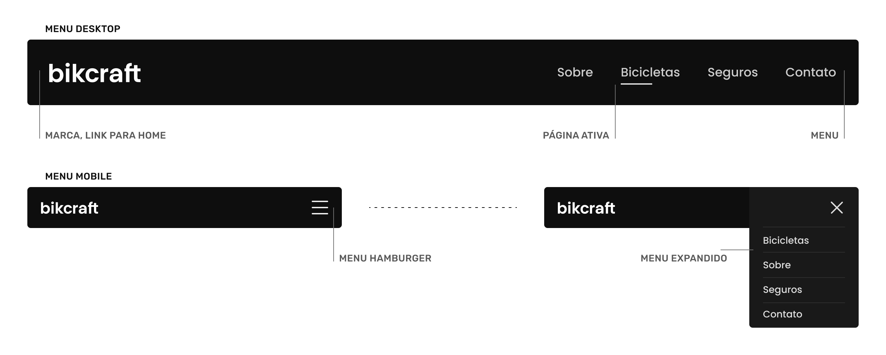

* Praticamente todos os cabeçalhos abaixo seguem a estrutura básica, porém com modificações para as necessidades do site.

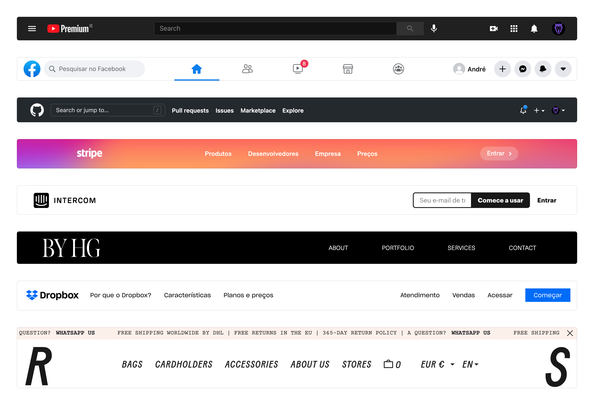

https://www.intercom.com/

https://www.studiobyhg.com/home

https://en.rsvp-paris.com/

## Menu Secundário
* Serve para expandir as opções do menu principal.

* No site da RSVP e da Apple ícones e imagens são utilizadas para diferenciar os itens do menu secundário.

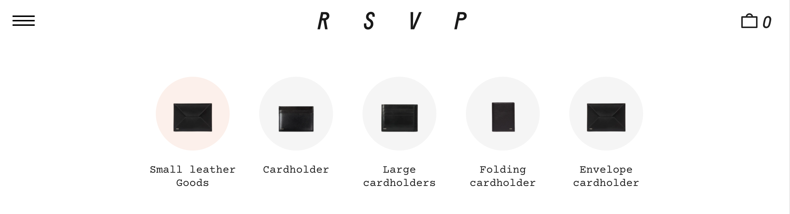

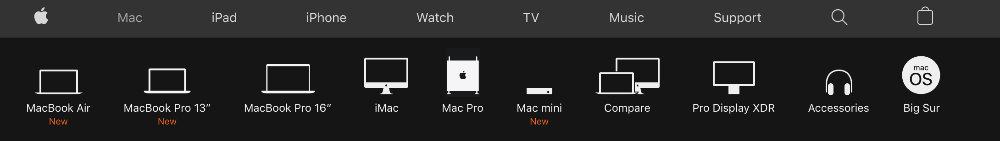

* Na documentação do Vue.js o menu secundário serve para informar ao usuário todas as seções que existem na documentação.

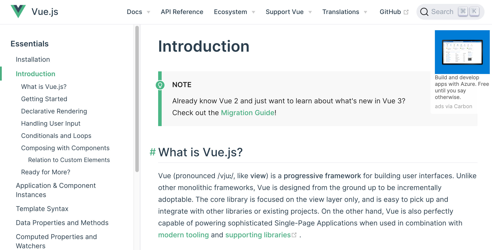

## Tabs
* As Tabs (abas), são menus localizados que geralmente não levam o usuário para outra página, mas sim para um novo conteúdo no mesmo local. As tabs são inspiradas em arquivos físicos, onde etiquetas indicam o conteúdo.

### Clicável
* Indicar que a aba é clicável.

### Estado
* Indicar claramente qual aba está ativa no momento.

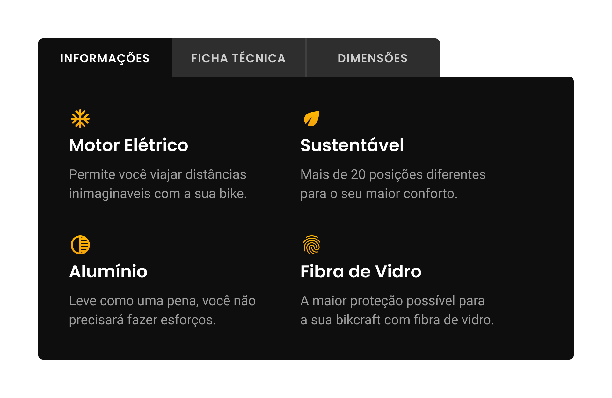

* A navegação por abas por ser utilizada de diversas formas diferentes, com imagens, ícones, marcas, etc. O princípio dela é ter uma lista que controle a troca de conteúdo.

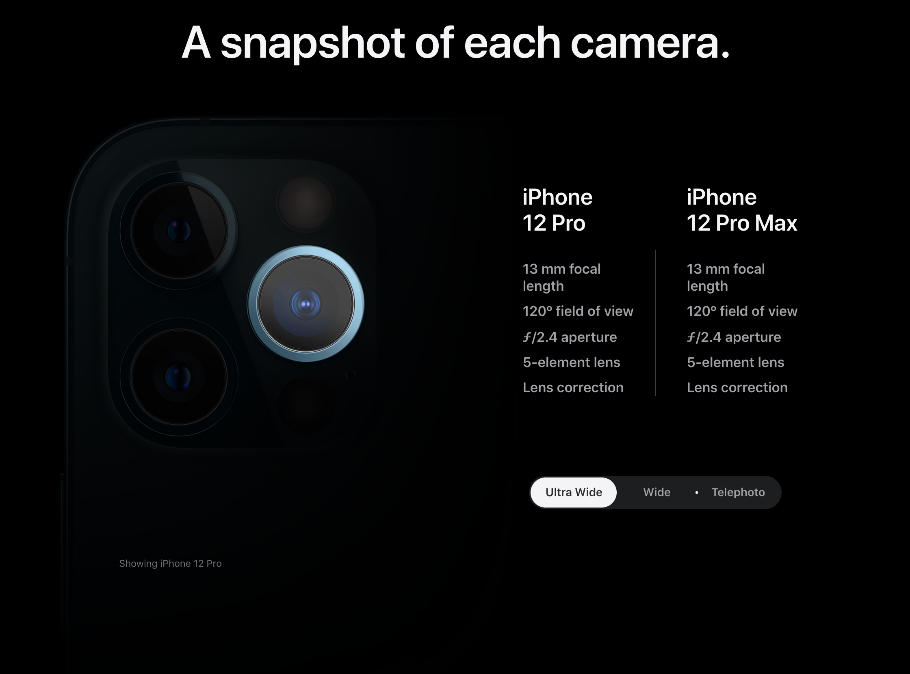

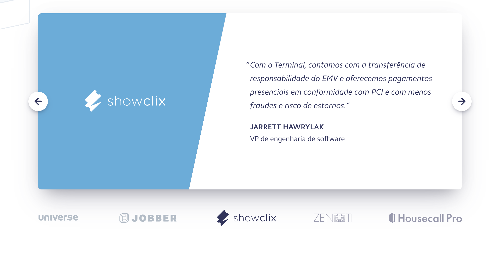

## Breadcrumb
* O uso de breadcrumb (migalhas de pão) é comum em sites que possuam diversos níveis e subníveis de informações, como em um comércio eletrônico.

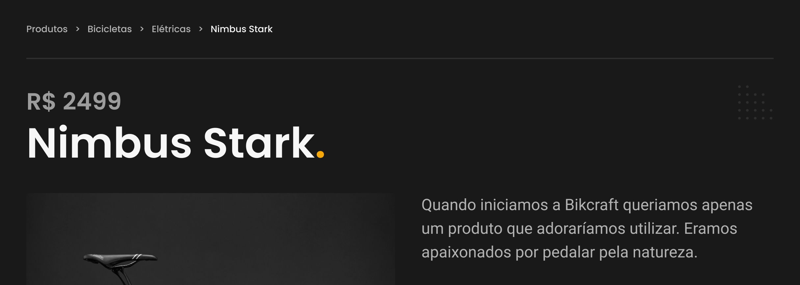

## Footer
* O Footer (rodapé) do site é geralmente utilizado para colocarmos um mapa de links do site. Não precisa ter exatamente todos os links, mas geralmente contém itens importantes que não fazem parte do menu principal, como: termos e condições ou a política de privacidade do site.

### Contato
* Colocar no footer as principais informações de contato.

### Links Importantes
* Ter links importantes que não foram colocados no menu principal.

### Redes Sociais
* Ter os links para as principais redes sociais utilizadas pela empresa.

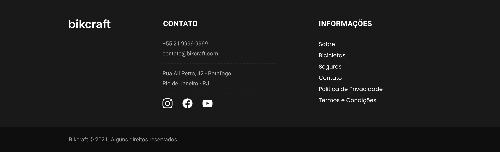

* O Stripe por ser um site complexo, aproveita o footer para colocar diversos links importantes para o site.

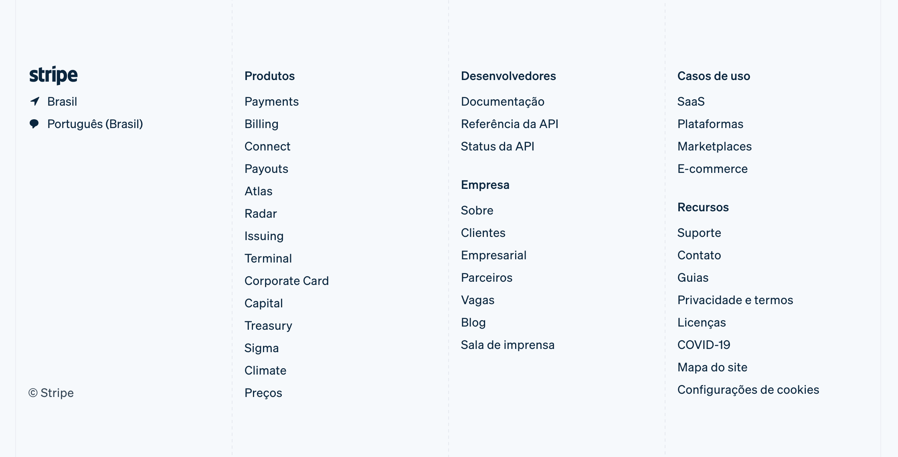
https://stripe.com/br

* O site da RSVP o footer é utilizado para disponibilizar dados de contato da sua principal loja, outros links importantes, links para redes sociais e também um formulário para captura de emails.

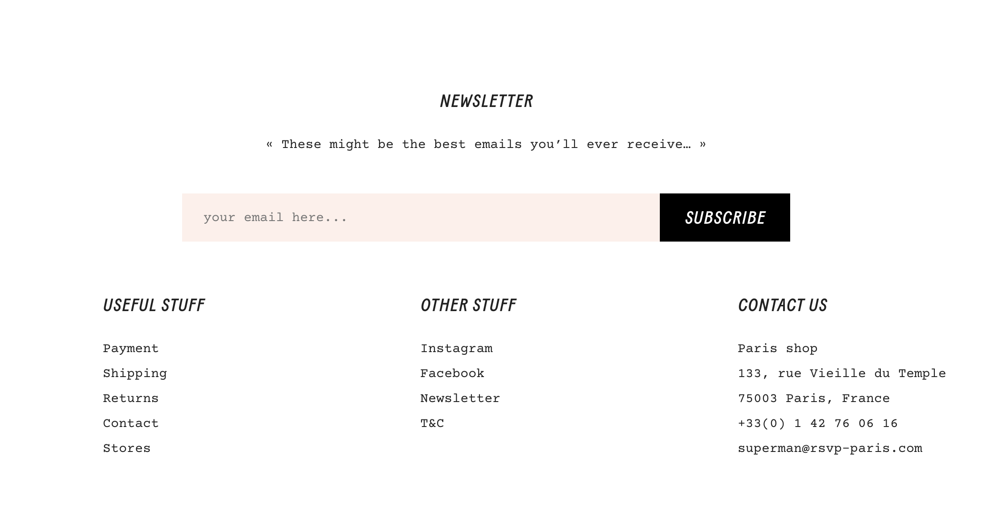

https://en.rsvp-paris.com/
