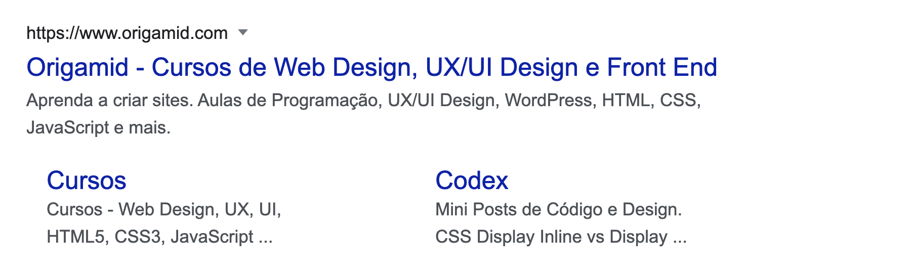
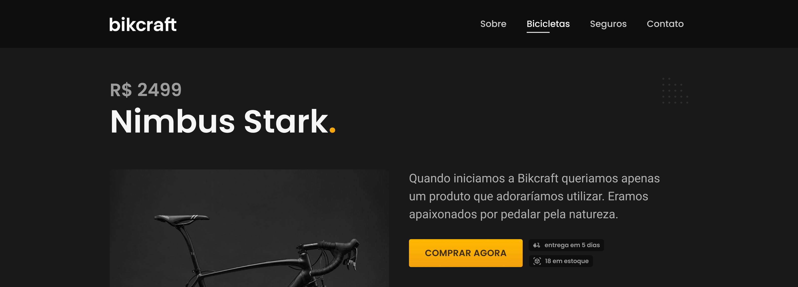
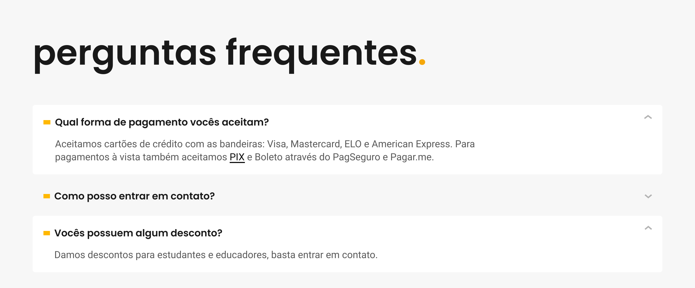
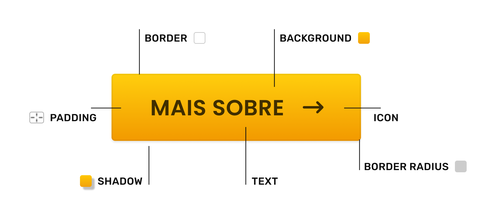
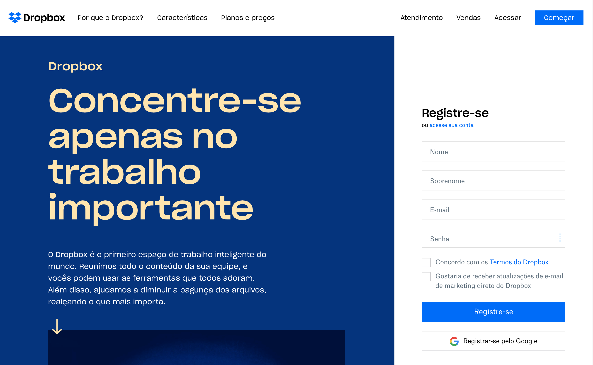
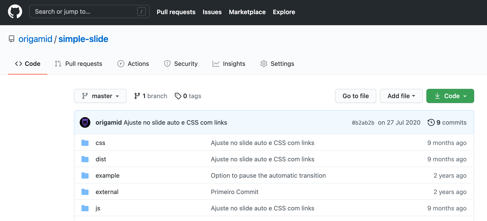
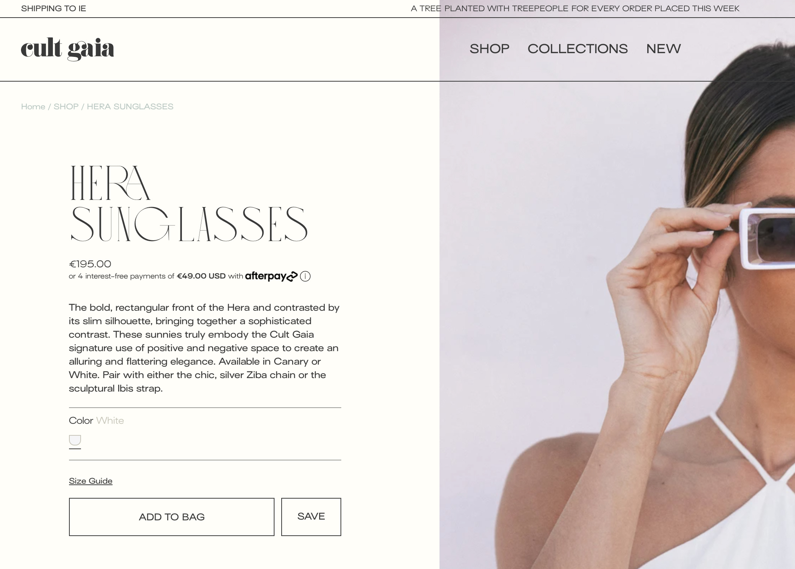
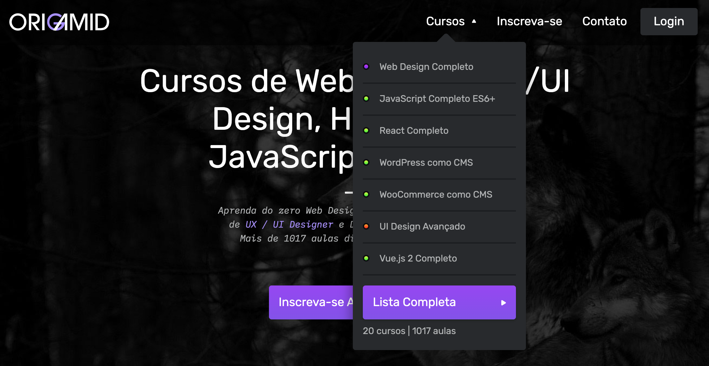
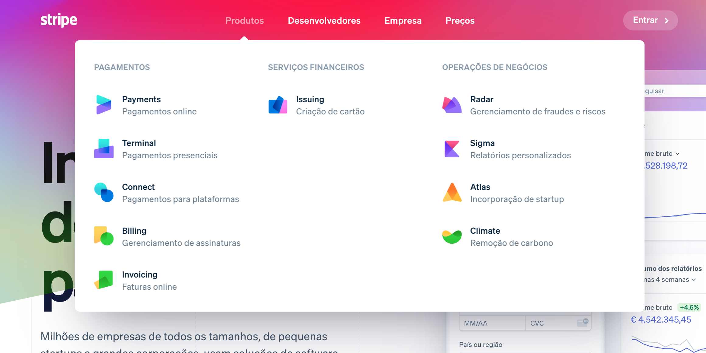
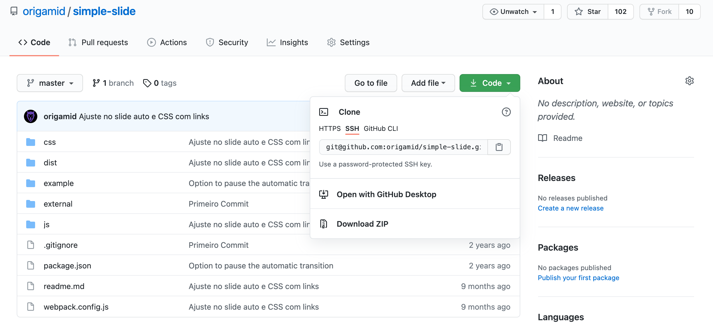

# Navegação Elementos

## Elementos

### Link

### Botão

### Dropdown

## Link
* O Link é um dos principais elementos da web, ele que permite navegarmos entre diferentes páginas para consumirmos informações.

### Contraste
* O link deve se diferenciar do conteúdo que não é clicável. Essa diferença pode ser criada com espaço, posicionamento, ícones, cores ou sublinhado.

### Estado
* Os links geralmente possuem diferentes estados, um para quando o mouse passa por cima, outro para quando é clicado e um último para quando o link já foi visitado.

### Clicável
* Garantir que o ícone seja facilmente clicável, principalmente no mobile.

https://www.google.com/search?q=origamid

* O posicionamento do texto pode indicar para o usuário que o mesmo é um link.

* Quando o link está localizado no texto, precisamos adicionar outros elementos para criarmos contraste suficiente entre o que é e o que não é link.

## Botão

### Funcionalidade
* O botão pode funcionar como um link <a>, levando o usuário para outra página. Ou como o ativador de uma função <button>. Exemplos: um botão que adiciona um produto ao carrinho.

### Contraste
* O botão deve se diferenciar dos demais conteúdos do site. Geralmente o texto do botão é envolvido em uma caixa.

* Na página inicial do Dropbox existem dois botões, com funcionalidades diferentes. O de começar funciona como um link, enquanto o de Registra-se possui a funcionalidade de cadastrar um novo usuário.

https://www.dropbox.com

* O Github utiliza constantemente botões com cantos arredondados, assim como em outros elementos da interface.

* No site Cult Gaia, o uso de botões em linhas apenas se comunica com o uso de linhas na interface. O contraste do botão é atribuído ao seu tamanho.

https://cultgaia.com/

## Dropdown
* O Dropdown é uma caixa que geralmente contém outros links importantes, que aparecem ao clicarmos (ou passar o mouse por cima) de um botão/link.

* Não precisa ser uma lista simples, no Stripe eles utilizam um mega dropdown, que possui ícones e informações extras sobre cada link.

https://stripe.com/br

* Os Dropdowns não precisam ser localizados apenas no menu principal, eles podem fazer parte de outros elementos da interface.
