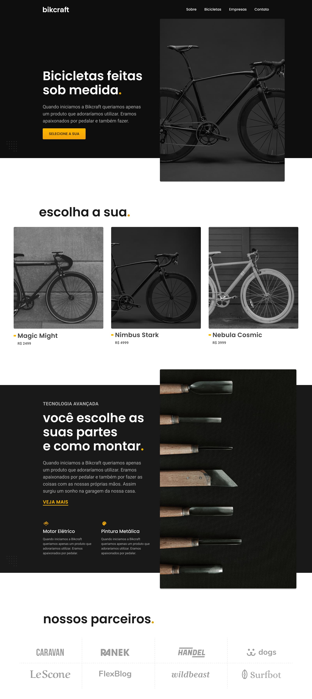
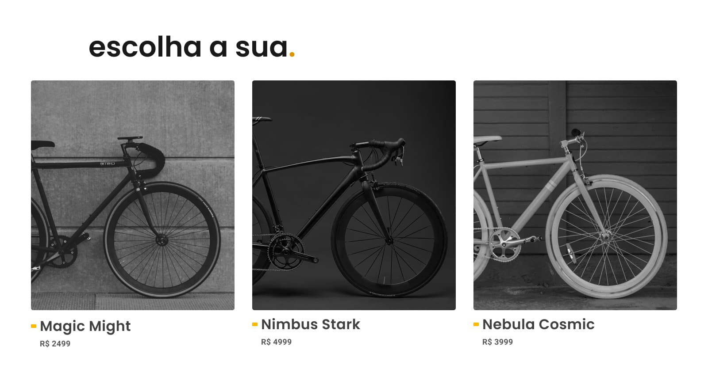
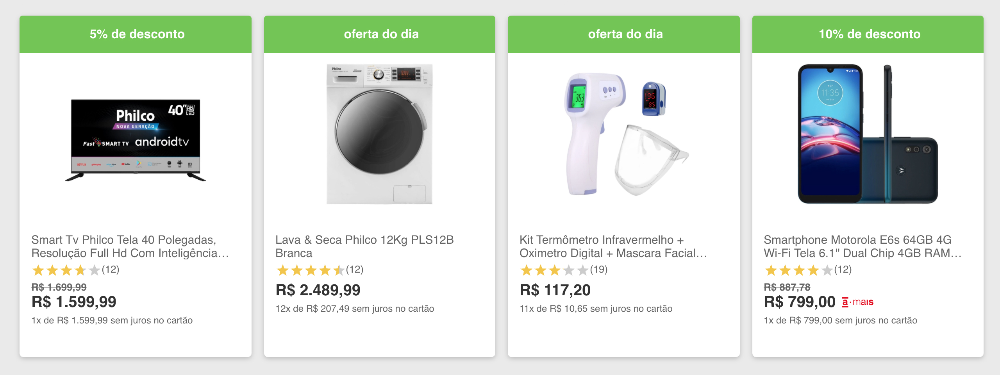
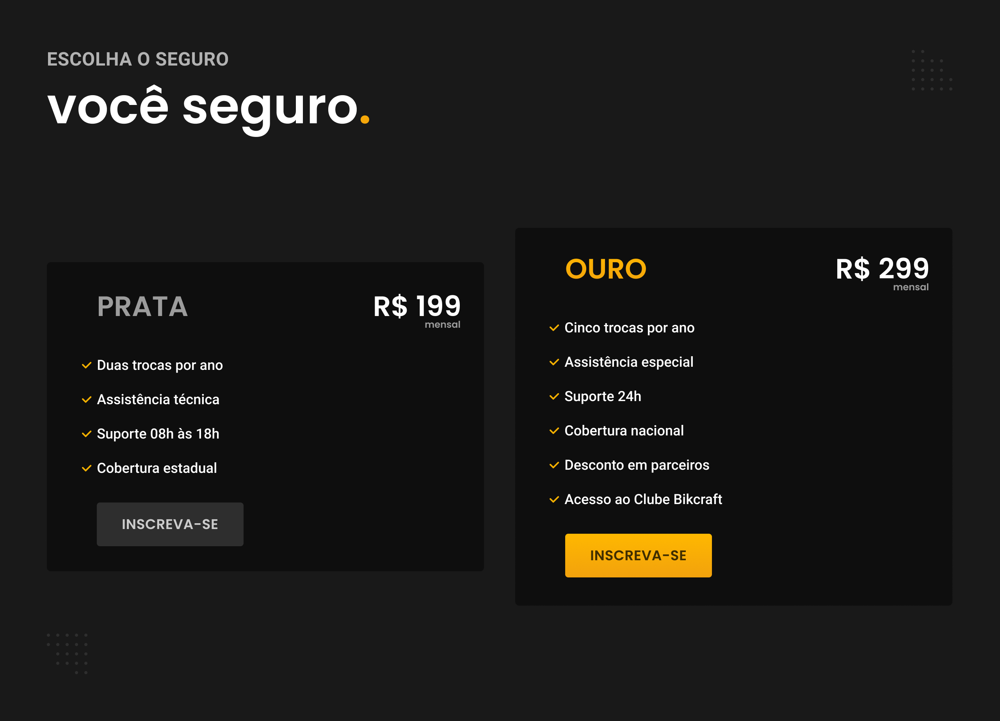
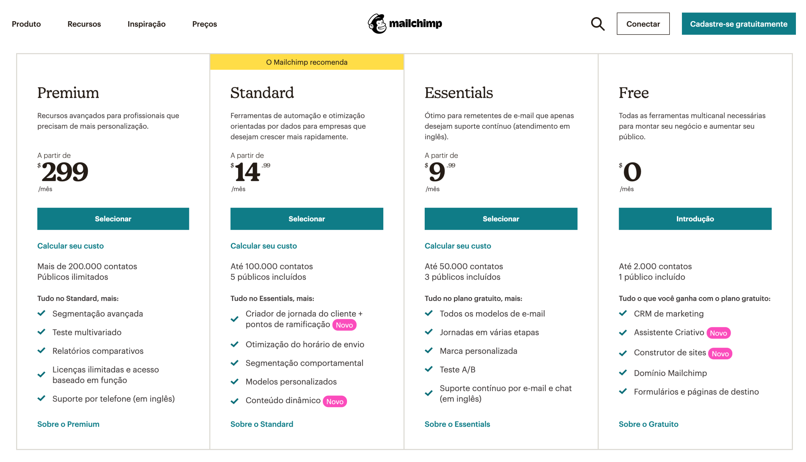
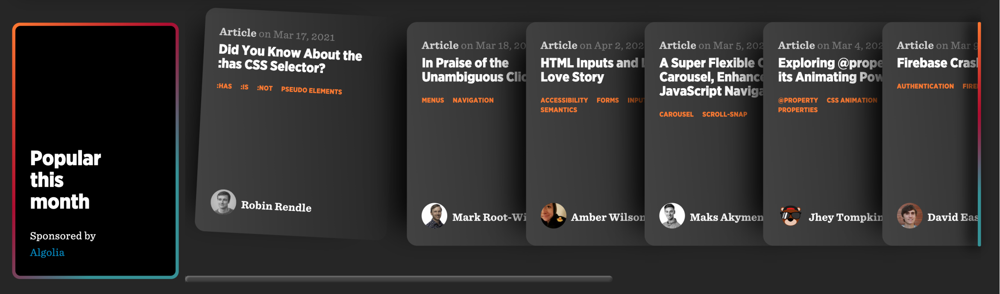

# Listas

## Listas

### Didáticas
* Listas tornam a informação mais fácil de ser escaneada e digerida.

### Diferentes Tipos
* Seções, produtos, preços e posts

### Lista > Parágrafo
* Tente transformar descrições em listas.

## Seções
* O conteúdo do site geralmente é dividido em uma lista de seções.

## Produtos
* Listas são utilizadas para mostrar o catálogo de produtos. As informações mais comuns em uma lista de produtos são: foto, nome e preço.

* No site da Americanas informações como as avaliações dos usuários e etiquetas de descontos/oferta também fazem parte da lista.

https://www.americanas.com.br/

## Preços
* Listas de preços/planos geralmente comparam as diferenças entre os planos.

* O Mailchimp recomenda com um banner o plano mais indicado para os clientes.

https://mailchimp.com/pt-br/pricing/

## Posts
* Uma lista de postagens/notícias é presente em quase todas as redes sociais, blogs e sites de notícias. Elementos comuns são: autor, data, título, thumbnail, tags, breve descrição, likes (aprovações) e comentários.

https://css-tricks.com/

* As informações da lista são conforme as suas necessidades. No YouTube o tempo do vídeo, thumbnail e total assistido são essenciais.

