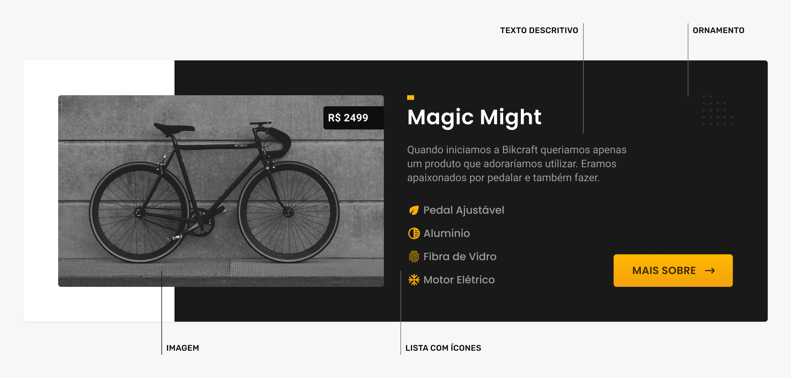
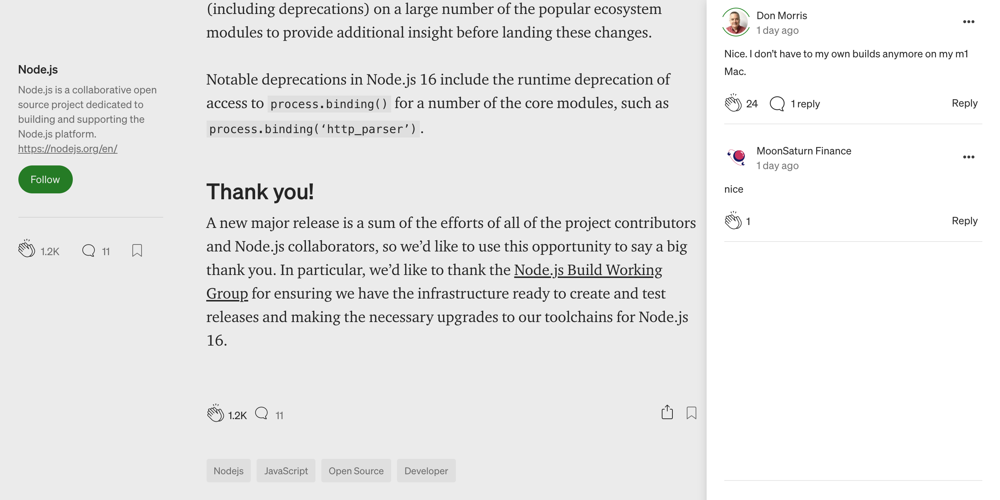

# Conteúdo

## Conteúdo

### Reduza
* "Tire metade do conteúdo da página. E do que sobrar remova a outra metade." Steve Krug, Não me Faça Pensar

### Texto/Visual
* Adicione elementos visuais ao conteúdo para tornar o mesmo mais interessante. Ex: imagens, vídeos, ícones, decorações, etc.

### Interação
* Se o conteúdo fizer parte de uma rede social/blog/site de notícias, permita a interação através de comentários, reviews/aprovações ou outras.

* O Stripe combina informações sobre a empresa com um globo dinâmico que mostra transações efetuadas. Além disso ele também quebra dados da empresa em uma lista, ao invés de aprensetá-los dentro de um parágrafo.

https://stripe.com/pt-br-ie

* O Medium permite a interação com o conteúdo através de aplausos e comentários.

https://medium.com/