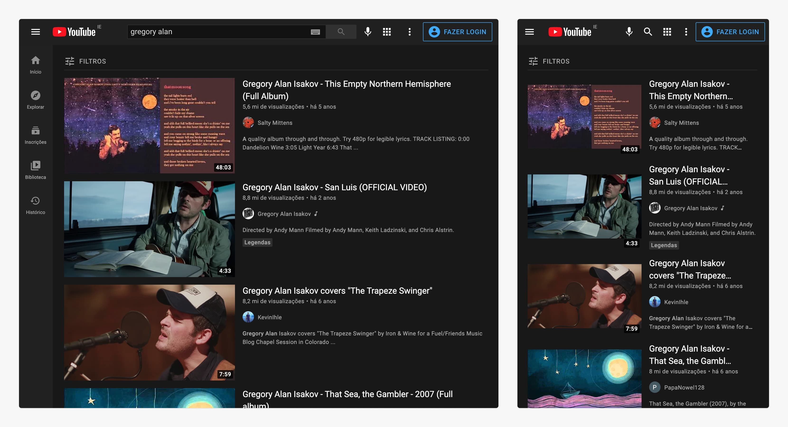
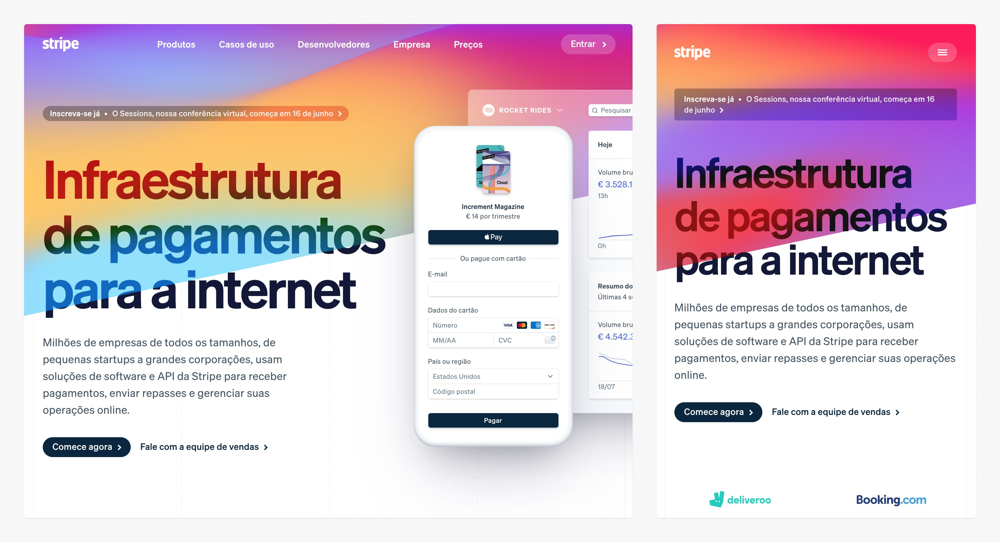
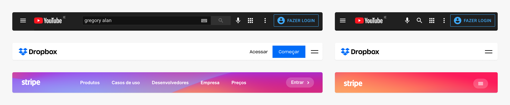
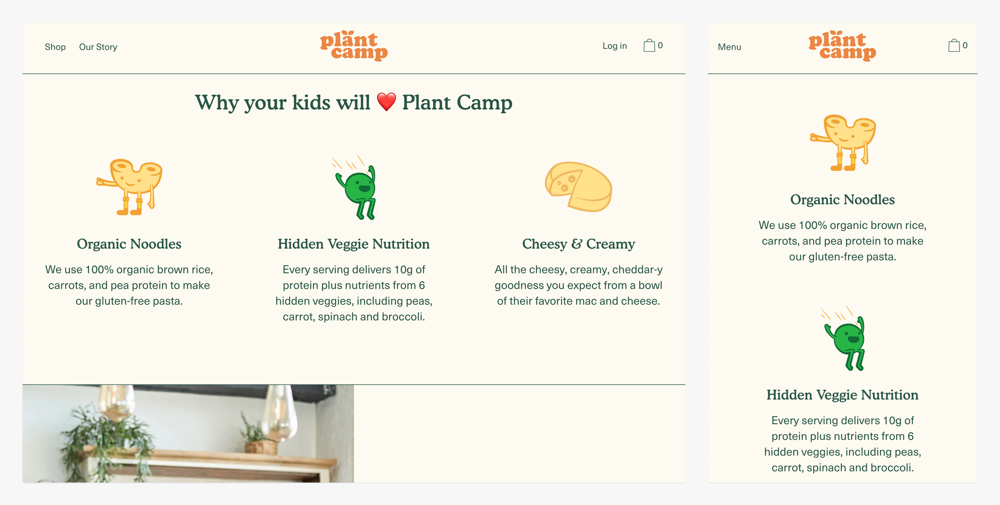
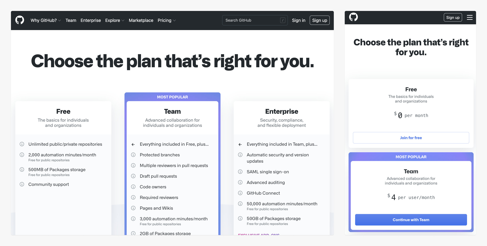

# Design Responsivo

## Interfaces Responsivas

### Se adapta ao meio
* Tamanho da tela (pequena, média e grande), tipo da tela (touch ou não).

### Único Artefato
* Ao invés de ter um site para cada meio, ter um único site que se adapta.

### Acessibilidade
* Web para todos.

* O YouTube esconde os itens do menu principal atrás do menu "hamburguer".

* O Dropbox remove a visibilidade inicial do formulário de registro.

https://dropbox.com/

* O Stripe remove a imagem ilustrativa e mantém apenas o texto.

https://stripe.com/

## Boas Práticas

### Mantenha as Funcionalidades
* Não assuma as necessidades do seu usuário.

### Simplifique/Remova Ilustrações
* Ilustrações ou elementos decorativos que ocuparem boa parte da tela, podem ser removidos em telas menores.

### Simplifique a Interface
* Esconda opções do menu, diminua o total de itens mostrados.

### Touch
* O dedo não é tão preciso quanto o ponteiro do mouse.

## Navegação
* O uso do menu mobile (hambúrguer), é uma forma de escondermos as opções de navegação através de um botão que mostra e esconde as mesmas.

## Listas e Conteúdo

### Simplificar
* Remover imagens, ornamentos e a quantidade de itens mostrados.

### Recompor
* 3 itens em 3 colunas, se tornam 3 itens em uma coluna, um abaixo do outro.

### Slides Horizontais
* Usados para apresentar listas de itens (funcionam ao arrastarmos o dedo).

https://plantcamp.com/

https://github.com/pricing