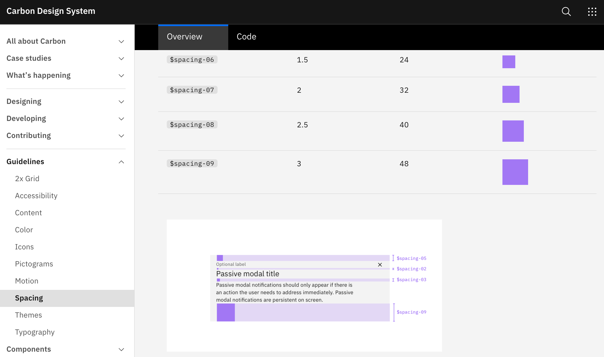
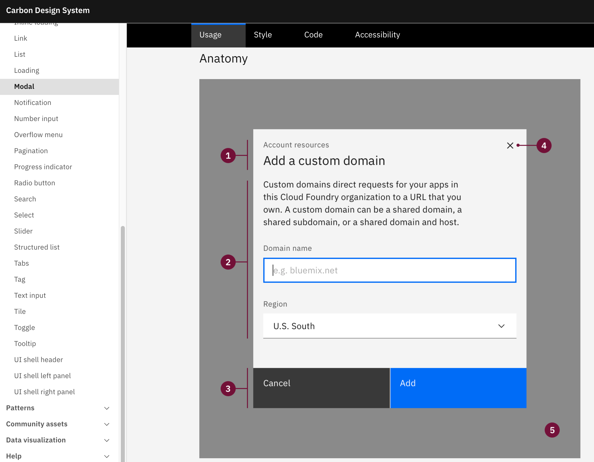

# Sistema de Design

## Sistema de Design

### Design Systems
* Conjunto de regras/elementos que são definidos para garantir consistência entre interfaces da marca.

### Regras
* A regras são definidas para todos os elementos do design, como espaços, cores, tipografia, grid, formas, imagens, ícones e mais.

https://www.carbondesignsystem.com/

* O sistema pode definir também como componentes comuns devem ser criados.

## Exemplos

### Material Design
* https://material.io/

### Carbon Design
https://www.carbondesignsystem.com/

### Bootstrap
https://getbootstrap.com/

### Tailwind
https://tailwindcss.com/

## Vantagens e Desvantagens

### Vantagens
* Maior agilidade na composição de novas ideias e garante maior consistência entre diferentes projetos.

### Desvantagens

Difícil de manter e pode acabar atrapalhando a geração de novas ideias.