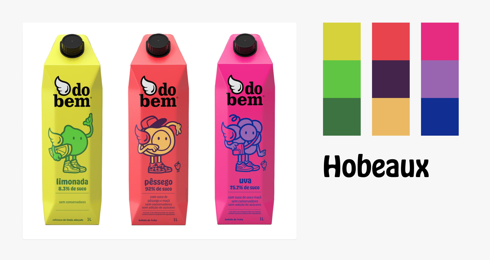
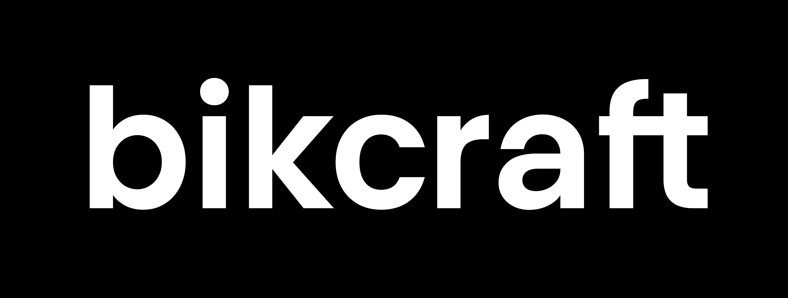
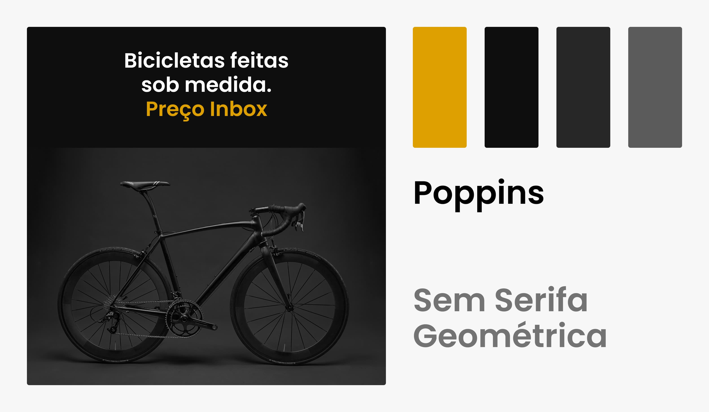

# Briefing Projeto

## Briefing
* A primeira etapa de qualquer projeto é entender sobre o projeto/empresa e as necessidades/desejos do cliente.

### Estilo
* Coletar peças anteriores criadas pela empresa que definem o estilo da mesma. Aqui vale observar cores, tipografia, formas e outros elementos já utilizados.

### Conteúdo
* Quais os principais serviços/produtos da empresa? Qual o objetivo com o site?

## Estilo

### Cores
* Base e ênfase. A cor de ênfase não precisa ser exatamente a cor da marca, mas uma variação da mesma.

### Tipografia
* Títulos, corpo e funcional. A tipografia para títulos (display) é uma das principais a ser influenciada pelo estilo da marca.

### Imagens
* São utilizadas mais fotos ou ilustrações? Qual o estilo dessas imagens?

## Estilo Briefing
* Lista de materiais para ajudar na criação e definição do estilo do site.

### Exemplo
```
Estilo
1. Marca
De preferência vetorizada (svg ou similar). Manual da marca se existir.

2. Materiais promocionais
Banners, embalagens, links para redes sociais e mais.

3. Referências
Sites e outras referências de gosto do cliente.
```

* A do Bem utiliza uma tipografia display sem serifa, arredondada e orgânica em suas embalagens, essa é uma oportunidade para a definição da tipografia dos títulos.



## Conteúdo

### Objetivo do Projeto
* Qual o tipo de site (institucional, comércio eletrônico, aplicativo web)? O cliente quer vender online ou ter apenas uma vitrine?

### Produtos/Serviços
* Quais produtos/serviços serão expostos no site (descrição e pontos fortes)? Qual a forma de contato para adquirir/tirar dúvidas sobre os produtos e serviços?

### Funcionalidades
* Será necessário cadastro de usuários, blog? Frequência de atualização?

### Outras Informações
* Terá uma parte falando sobre a empresa, história, funcionários, vagas, eventos?

## Conteúdo Briefing
### Exemplo
```
Conteúdo
1. NECESSIDADES DO CLIENTE
1.1. Me conte sobre a sua empresa, o que ela faz e a sua história.

1.2. Caso já possua um site, quais são os seus resultados?

1.3. O que te levou a querer criar um site (novo)? Qual o objetivo dele?

2 SOBRE A EMPRESA
2.1. Que serviços / produtos você oferece e a quanto tempo? Todos serão mostrados no site? Serão mostrados preços no site ou será necessário o usuário pedir um orçamento?

2.2. Os possíveis visitantes do site estão familiarizados com o produto que você oferece ou precisam ser apresentados?

2.3. Quais dados de contato serão mostrados no site? Telefone, endereço e e-mail? Será necessária a criação de um formulário de contato?

2.4. É relevante mostrar os seus principais clientes / parceiros?

2.5. Quais os principais pontos fortes da empresa?

3. Sobre o site
3.1. Você já pensou em uma possível divisão do conteúdo no site?

3.2. O site vai precisar de alguma funcionalidade específica?

3.3. De quanto em quanto tempo as informações do site devem ser atualizada?
```

## Bikcraft Marca
* Bikcraft é uma empresa que vende bicicletas de alta qualidade e precisão.



## Bikcraft Estilo
* Post do Instagram da Bikcraft.



## Bikcraft Briefing
### Exemplo
```
Conteúdo
1. NECESSIDADES DO CLIENTE
1.2. Cerca de 20 orçamentos solicitados por semana.

1.3. Modernizar o site e fornecer mais informações sobre os produtos.

2 SOBRE A EMPRESA
2.1. Venda de bicicletas e seguros.

2.2. Estão familiarizados com as bicicletas, mas não com os seguros.

2.3. Telefone, endereço e e-mail das duas lojas. Terá formulário.

2.4. Sim, possuo parceiros que fornecem materiais de alta qualidade.

2.5. Nossos produtos são feitos com total precisão e todos eles são inspecionados minuciosamente antes de serem entregues aos clientes.

3. Sobre o site
3.1. Uma área para mostrar os produtos, planos e uma página de contato.

3.2. O cliente deve poder pedir o orçamento direto no site.

3.3. Todo mês.
```

## Site para descobrir fonte utilizada
https://www.myfonts.com/pages/whatthefont