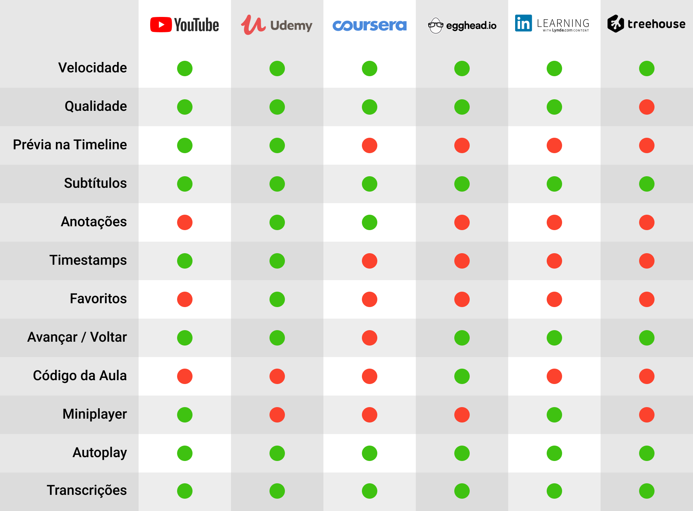
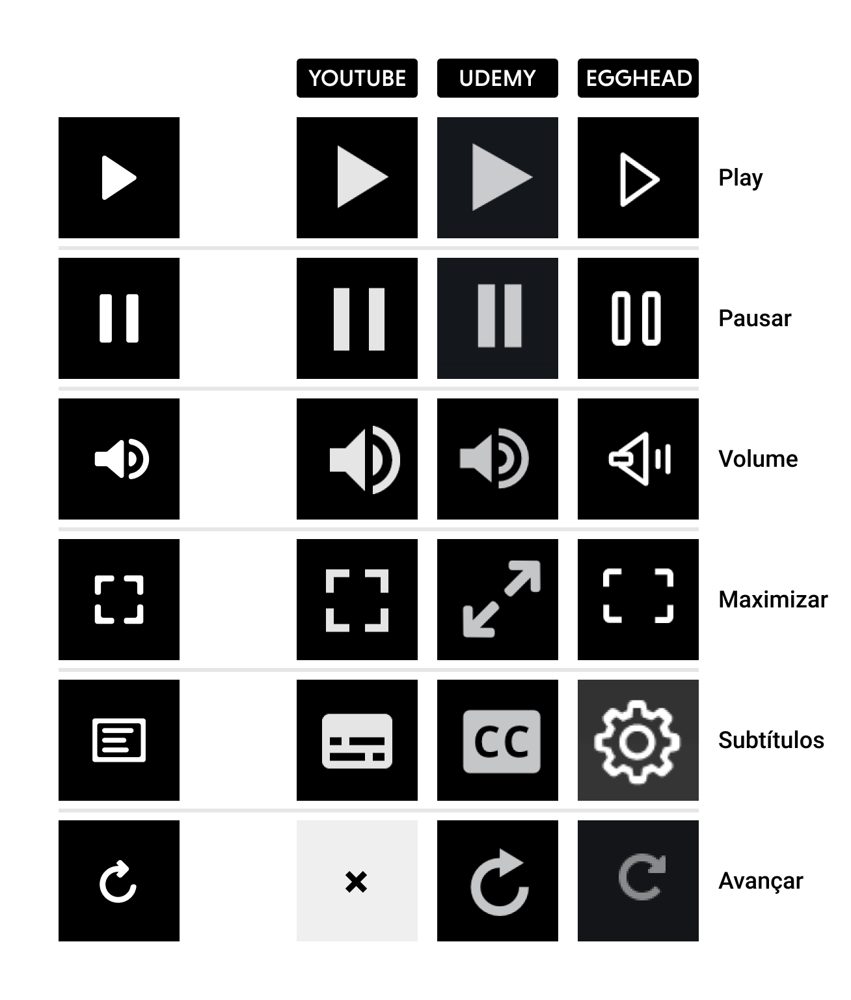

# Pesquisa Mercado

## Pesquisa de Mercado
* Entender o que os concorrentes e similares estão fazendo.

### Informações
* Qual tipo de informação é disponibilizada no site? Preço, contato (email, chat), ficha técnica, assistência?

### Funcionalidades
* O que é possível fazer no site? Comprar, solicitar orçamento, entrar em contato via chat, reservar um horário?

### Estilo
* Cores, tipografia, formas, imagens e mais.

* Funcionalidades de diferentes players de vídeo.

* Comparação entre ícones utilizados nos players de vídeo.

