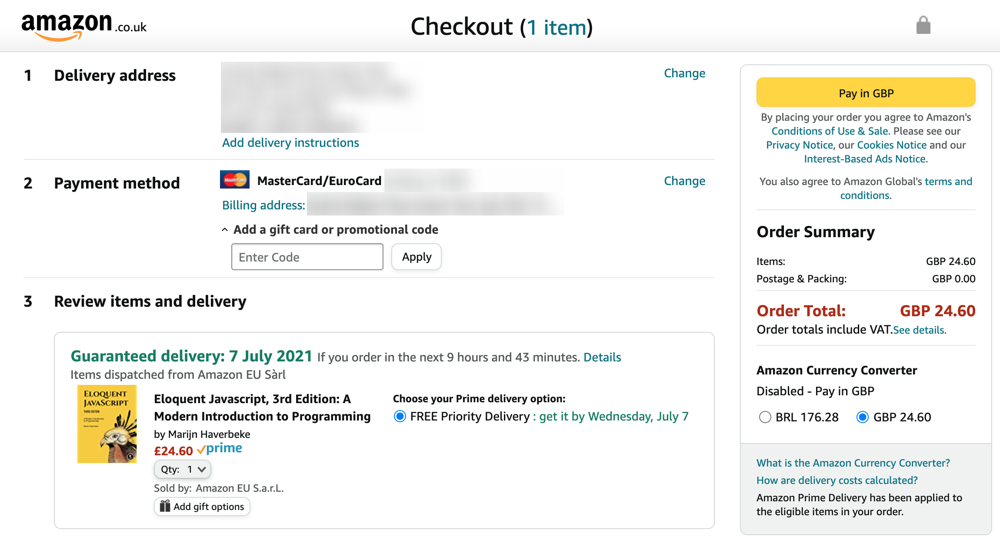
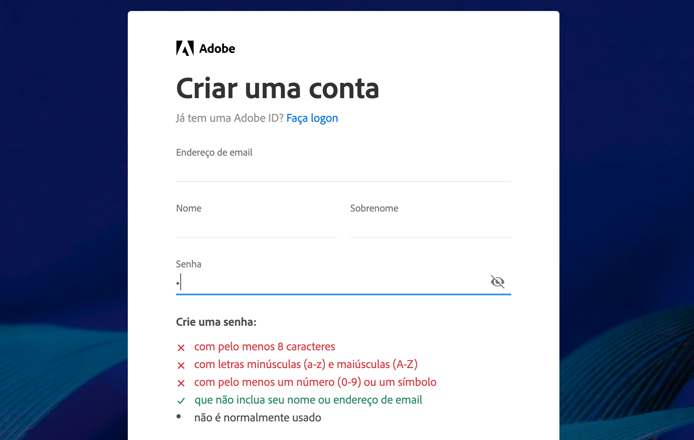

# Heurísticas

## Heurísticas
* Regras "geralmente" testadas em diferentes projetos que provaram ser efetivas.

### 10 Heurísticas de usabilidade de Jakob Nielsen
* https://www.nngroup.com/articles/ten-usability-heuristics/

### UX Design Heurísticas
* https://www.origamid.com/curso/ux-design-heuristicas/

## Controle/Liberdade
* Dê liberdade ao usuário para reparar/modificar as suas ações.

https://www.amazon.com.br/

* A Amazon permite modificarmos qualquer informação (entrega, cobrança, itens adicionados) no momento final da compra.

## Consistência
* Uma interface consistente é mais simples de ser aprendida.

https://github.com/

* O Github utiliza a mesma seta em todos os botões que possuem um menu dropdown. O uso de ícones de pastas para indicar diretórios dentro do repositório garante consistência entre interface do site e do sistema.

## Prevenir Erros
* Prevenir que os usuários cometam erros com instruções claras e confirmações para ações importantes.

https://creativecloud.adobe.com/pt

* A Adobe previne que o usuário crie uma senha fraca indicando exatamente as regras que devem ser seguidas para garantir uma senha forte.

## Visibilidade
* O que estiver visível será mais utilizado do que o que estiver escondido.

https://www.figma.com/

* Estudo sobre a eficácia de botões hamburgers (navegação escondida).
https://www.nngroup.com/articles/hamburger-menus/

## Engajamento Gradual
* Pedir as informações gradualmente para o usuário, ao invés de pedir tudo de uma vez.

https://wise.com/

* O Wise pede por etapas as informações necessárias para fazer uma transferência.

## Opções
* Quanto menos opções, maior a chance do usuário adquirir o produto.

https://www.sketch.com/pricing/

* Barry Schwartz fala sobre dois possíveis efeitos negativos: paralisia por análise e remorso de compra.

https://www.youtube.com/watch?v=VO6XEQIsCoM

https://www8.gsb.columbia.edu/researcharchive/articles/882