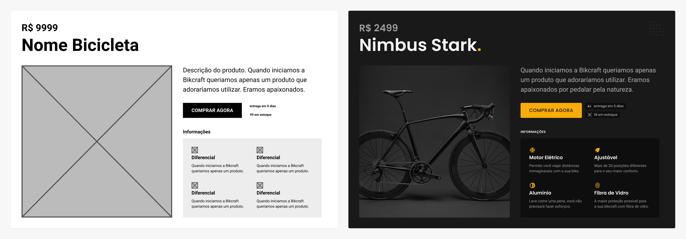

# Wireframe

## Wireframe
* É um desenho básico da interface que tem como objetivo retratar a disposição das informações e a usabilidade.

## Vantagens

### Maior flexibilidade para mudanças
### É de rápida elaboração
### Facilita a criação do design final
### Permite testes com o usuário no início do projeto